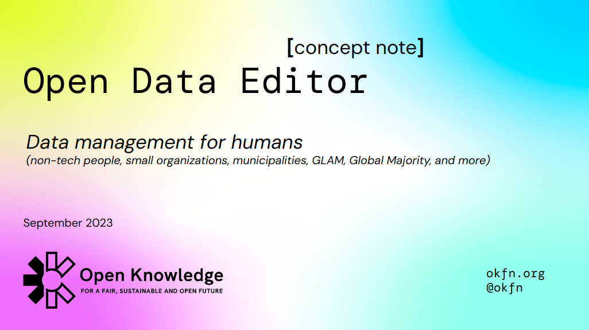

# Open Data Editor

<strong>Open Data Editor (v1)</strong> for early adopters has been released on <strong>
Oct 2, 2023
</strong> -- [READ THE CONCEPT NOTE](https://docs.google.com/presentation/d/1wh3r6fC6gsiUx0tBwon4HT8dqufFV0C5GE6IG4PG7jI/edit)

