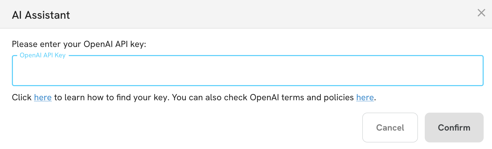

# AI integration

The ODE has an AI component to help users understand better their data. The AI component is powered by local models so all the data, metadata, prompts and responses are always executed on the user's machine. In order to use the AI feature, ODE will guide the user to download the model into their machine first.

The AI component is still in beta and will improve over time.

:::{note}
As the model is local and all computing will be happening in the user's computer, performance will be affected by the machine's hardware and the responses quality sometimes will be minor than typical cloud LLMs like ChatGPT, Deepseek or Claude.

ODE is trying to make a good trade-off between user experience for non-technical audiences, performance and privacy.
:::

## How to use the AI component

To use the AI assistant select a file from the sidebar, and then click on the AI button located on the top right corner of the app:

ODE will show a dialog to assist the user in downloading the model:

Once the model is downloaded, the user will be able to click on the **Next** button to continue.

## AI Use Cases

ODE has two use cases for the AI component:

1. Assist the user in understanding the columns of a table.
2. Suggest analysis and questions that the user can query to the data.

To choose the use case, select it from the dropdown menu.

Once selected, click on the **Execute** button to get a response from the AI model.

:::{note}
Depending on the hardware of the user's machine, the response time can vary. Usually it will take around 10 seconds to get a response.
:::

### Assist the user in understanding the columns of a table

The AI model will analyze the columns' names, types and some sample data and will generate a description of each column. This is useful to understand the data better, clarify technical of complex names, expand acronyms, etc.

### Suggest analysis and questions that the user can query to the data

The AI model will analyze the columns' names, types and some sample data and will generate a list of questions that the user can query to the data.

