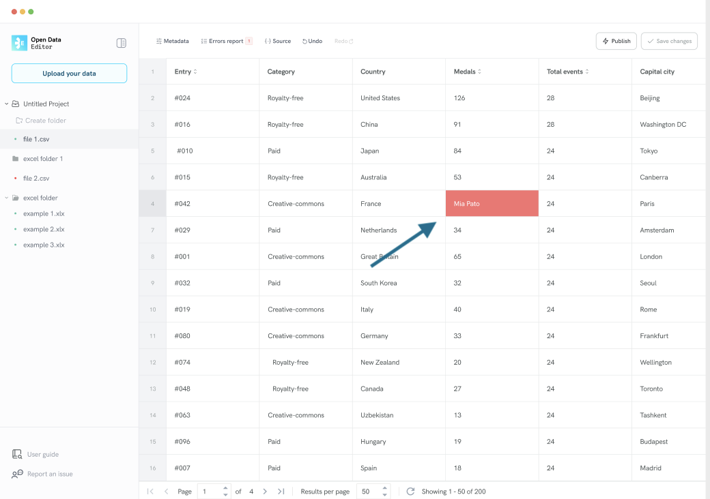
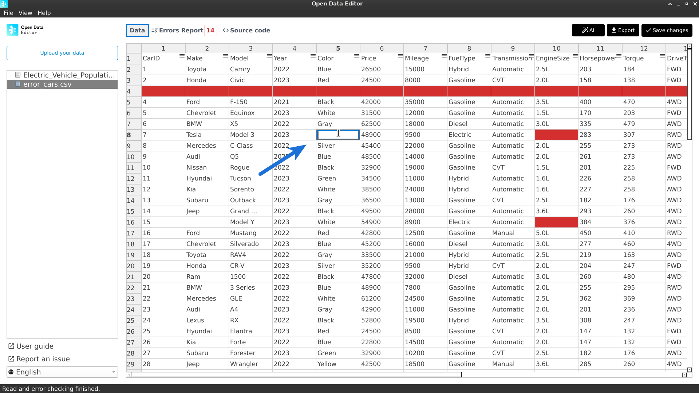
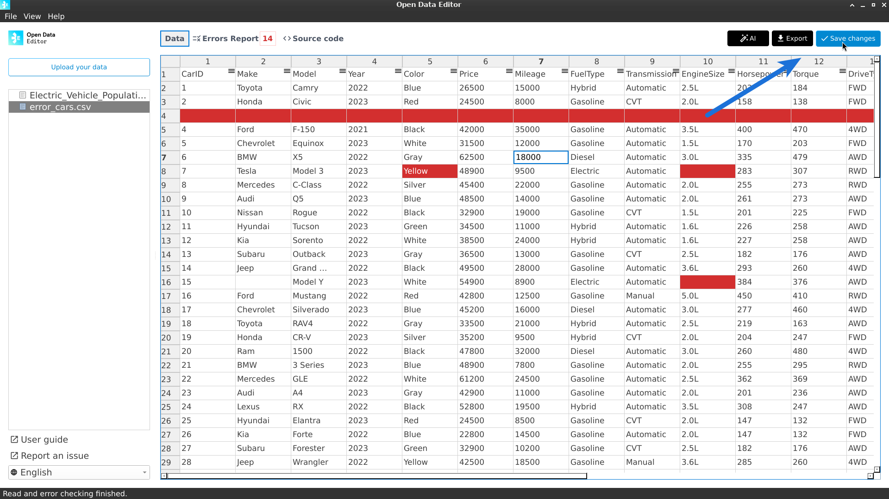

# Editing errors in tables

To fix cell errors, you can directly edit the data cells in the viewer/editor.

**Step 1:** Locate the cell with the error. For example:

**Step 2:** Double-click on the cell to start editing content:

**Step 3:** To save changes, click the **Save changes** button at the top right of the datagrid. The button will get activated if there are unsaved changes.

After clicking the **Save changes** button, the ODE will update the errors report.

👉🏼 You can undo or redo/undo unsaved changes by clicking on the **Redo/Undo** features at the **top left** of the datagrid.

:::{note}
If you click outside the datagrid without saving changes, the ODE will display a dialog with two options: save changes or discard them.
:::

