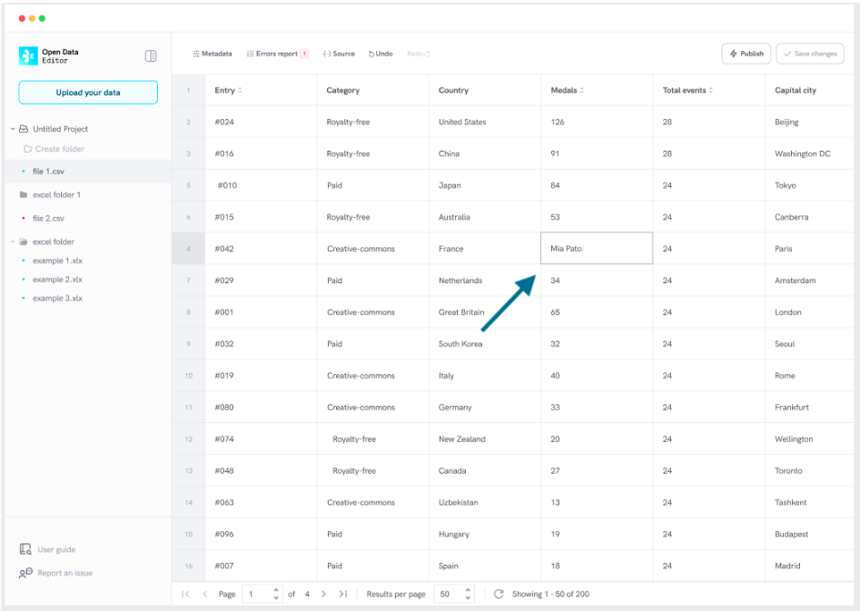
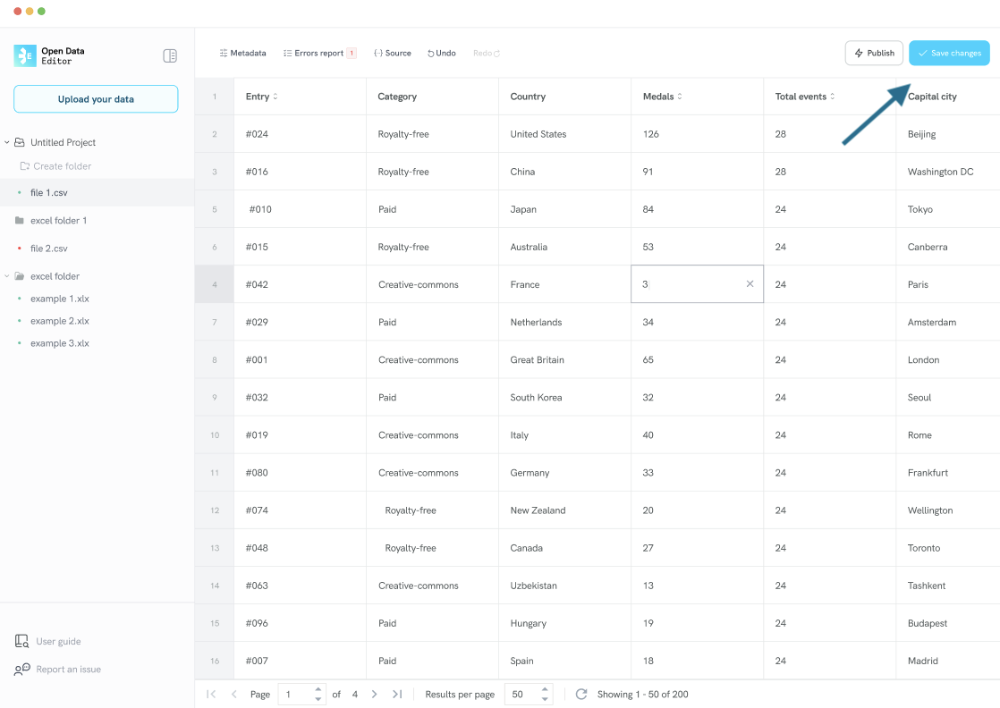

# Editing errors in tables

To fix cell errors, you can directly edit the data cells in the viewer/editor.

**Step 1:** Locate the cell with the error. For example:

**Step 2:** Double-click on the cell to start editing content:

**Step 3:** To save changes, click on another part of the table to accept the change in the cell and when the the **Save changes** button is activated click on it. The button will get activated if there are unsaved changes.

After clicking the **Save changes** button, the ODE will update the errors report.

