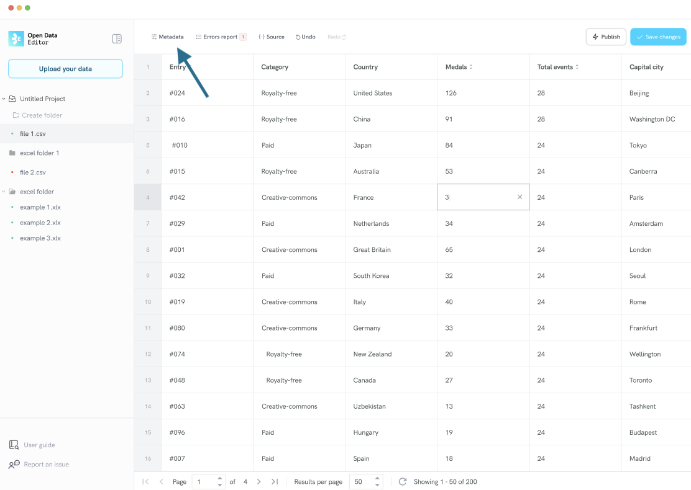
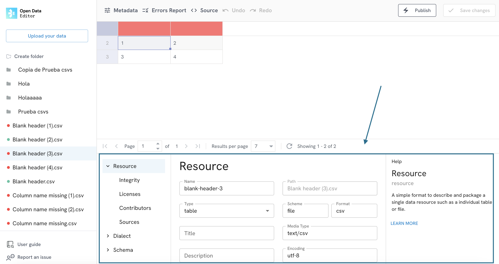

# How to explore and edit metadata

To explore or edit the metadata, select a file from the menu on the left and click on any cell of the header row (first row).

The ODE will then display the **Metadata window**:

You can click on any of the options to start editing the metadata linked to your file.

Once you have finished editing the metadata, click on the **Save changes** button to save the changes.

:::{note}
Saving changes will trigger a validation of the file.
:::
