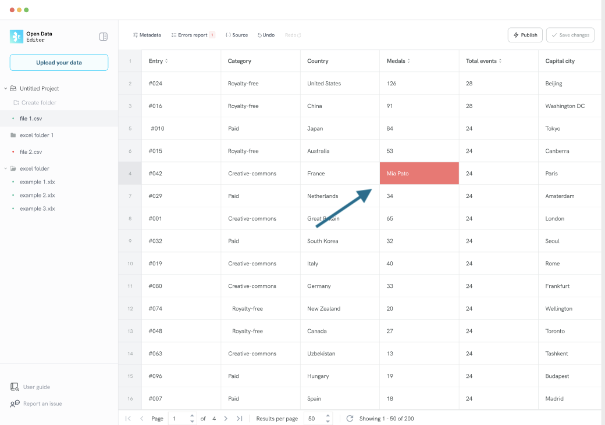
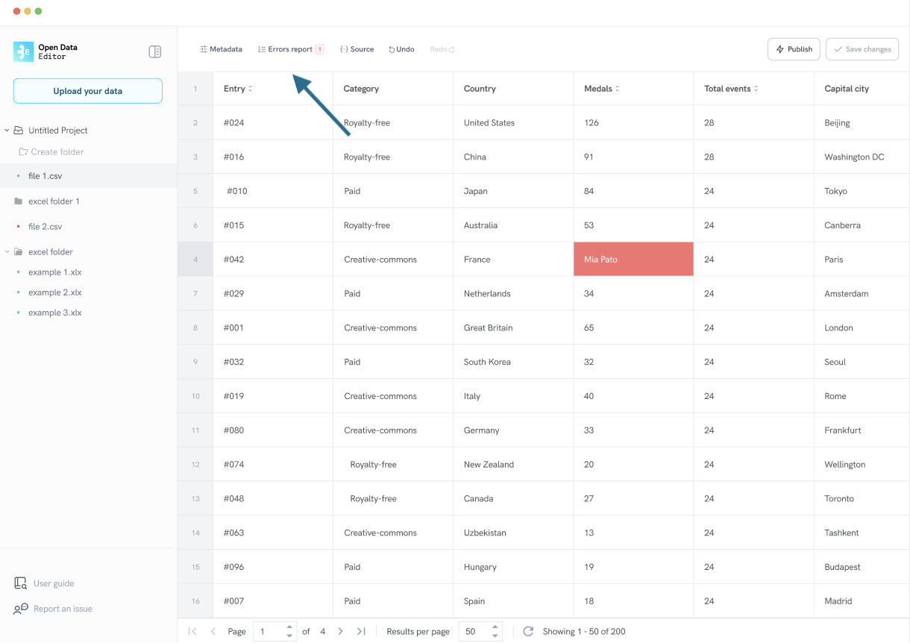
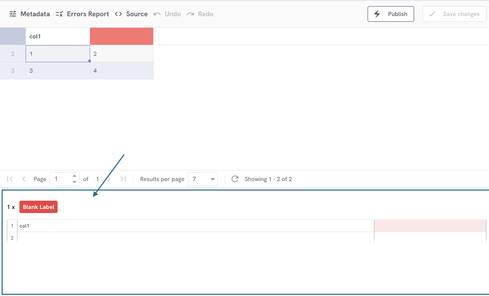

# How to explore table errors

As mentioned in the **Uploading data** section in this guide, if a file has errors, the ODE will show a red dot next to the file name on the sidebar.  However, if you want to review errors in the table, you can use the datagrid to explore problematic data.

The ODE will highlight the cell in red if it has a problem. For instance, if it contains text instead of a number.

This is how a cell with an error is shown on the ODE:

You can also explore errors by clicking on the **Errors report** button, located at the **top left** of the datagrid:

After clicking the button, the ODE will display a panel with the full list of errors:

