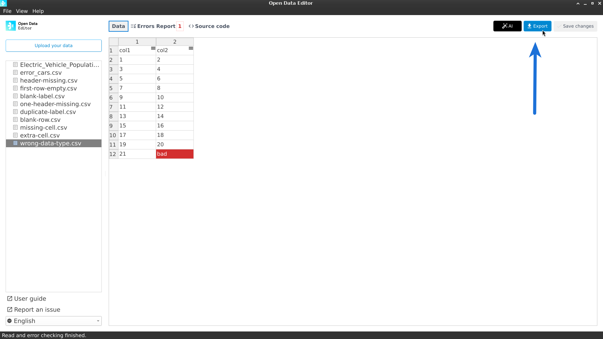
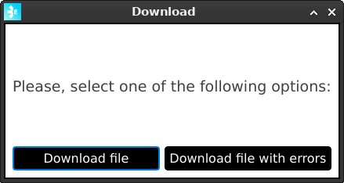

# Exporting your data

You can export your data using the **Export** feature located at the top right of the datagrid:

Once you click the **Export** button, the ODE will display the following dialog:

## Download File

This option will download the file in CSV format.

## Download file with errors

This option will export an excel file with three sheets:

- **Data**: This sheet contains the original table with all the errors painted in red.
- **Errors Description**: This sheet contains the description of the errors detected by the ODE with the corresponding cell (row and column).
- **Blank Rows**: This sheet contains the rows on the original table that did not contain any values.

