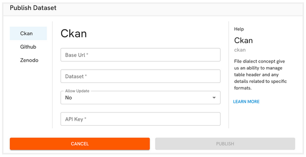

# Publishing your data

You can publish a file using the **Publish** feature located at the top right of the datagrid:

Once you click the **Publish** button, the ODE will display the following dialog:

:::{note}
To be able to publish, you have to set the required credentials to connect to a data portal (CKAN, Zenodo, Github).
:::

## Zenodo

:::{note}
Open Data Editor will create a new draft on Zenodo. You will need to go to Zenodo to complete the publication process.
:::

To publish your data on Zenodo, you need to provide the following information:

- **Title**: The title of the dataset.
- **Description**: A description of the dataset.
- **Author**: The author of the dataset.
- **API Key**: Your Zenodo API key. You can find it in your Zenodo account settings:
  - Go to the [token creation page](https://zenodo.org/account/settings/applications/tokens/new/)
  - Set the name of the token (e.g. ODE)
  - Set scopes to `deposit:write`
  - Click on the `Create` button
  - Copy the token, securely save it

## GitHub

:::{note}
Currently, Open Data Editor requires the `repo` scope to publish data on GitHub. The ODE team will review this scope in the future.
:::

To publish your data on GitHub, you need to provide the following information:

- **User**: Your GitHub username.
- **Repo**: A new repository where the data will be published.
- **Email**: Your email address.
- **API Key**: Your GitHub API key. You can find it in your GitHub account settings:
  - Go to the [token creation page](https://github.com/settings/tokens/new)
  - Set the note for the token (e.g. ODE)
  - Set expiration date
  - Select the `repo` scope
  - Click on the `Generate token` button
  - Copy the token, securely save it

## CKAN

To publish your data on CKAN, you need to provide the following information:

- **Base Url**: Endpoint url for CKAN instance. e.g. https://dados.gov.br
- **Dataset**: The dataset name where the data will be published.
- **Allow Update**: If checked, it will overwrite the selected dataset (use with caution!).
- **API Key**: Your CKAN API key. You can find it in your CKAN account settings:
  - Go to the API key page in the CKAN instance settings
  - Copy the API key, securely save it
