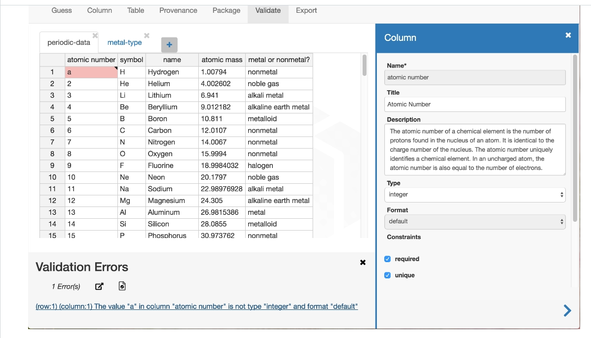
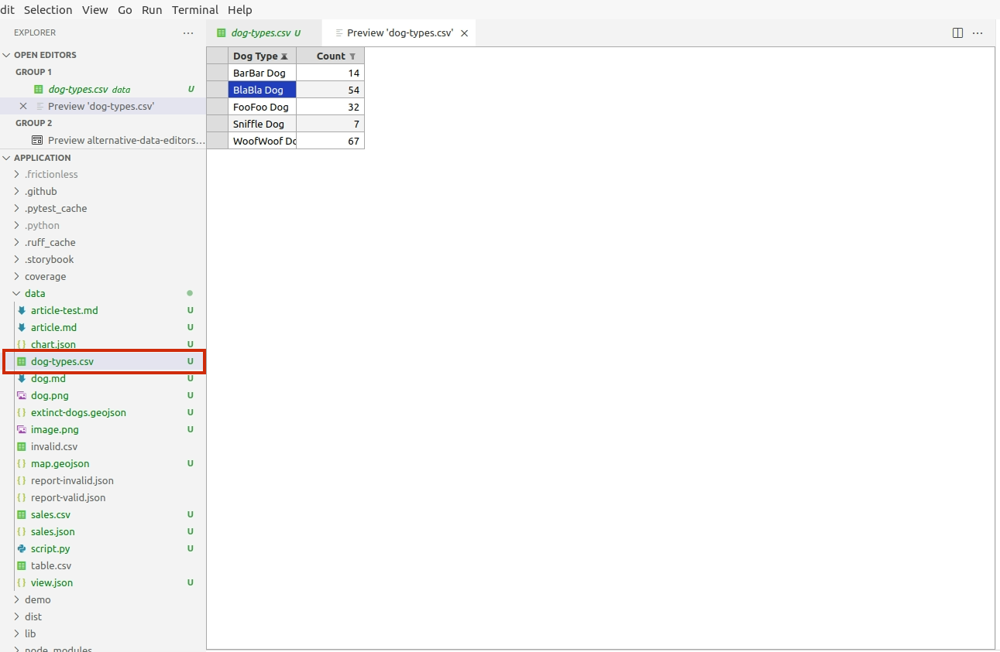
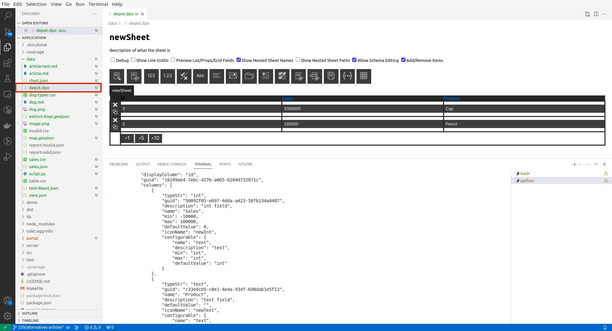

# Similar tools

There are several alternatives available with their own pros and cons. Let's comapre them with **Open Data Editor** to have a better understanding of the Data IDE field.

## Data Curator

Data Curator application has features to describe, validate and publish data. The published data will be in machine-readable and reusable format. It uses frictionless `Data Package` standards and has integration with CKAN. The data curator is also available through Microsoft Windows store and MAC App store. More information about OpenRefine can be found [here](https://github.com/qcif/data-curator).

### Excel Viewer

### Deport Data Editor

