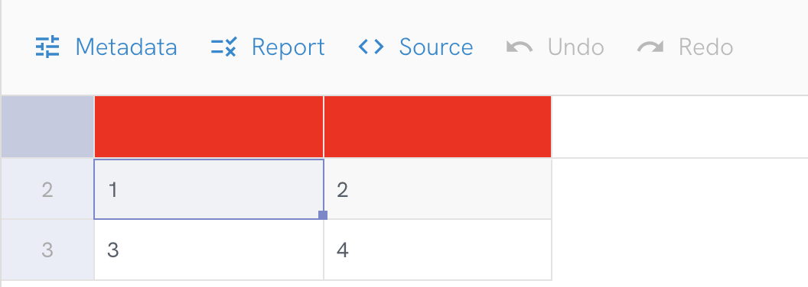
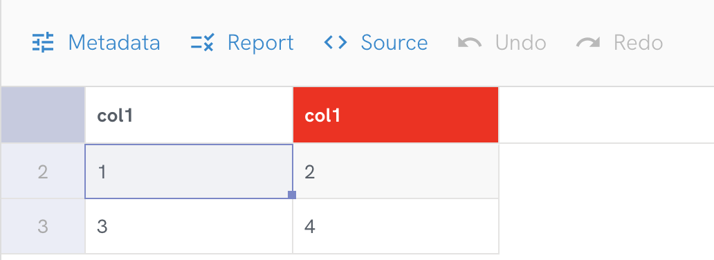
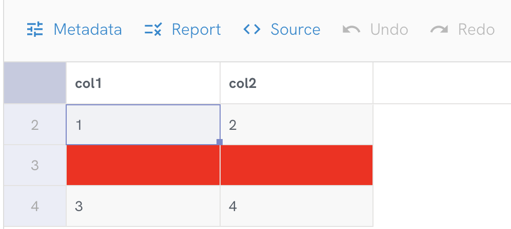
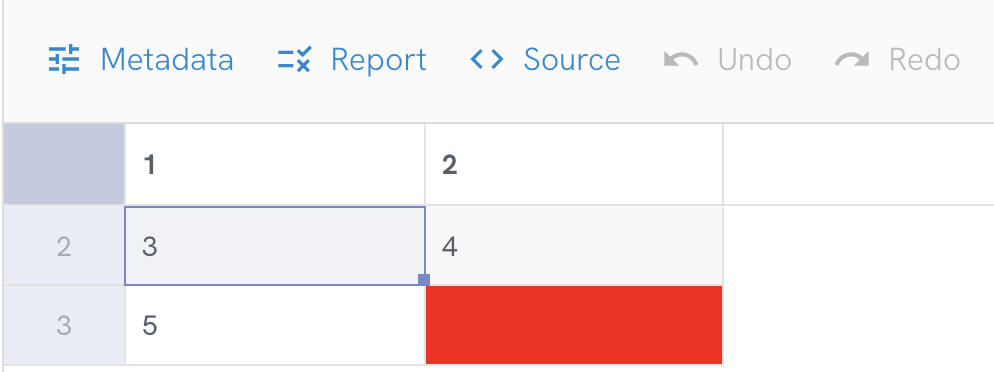
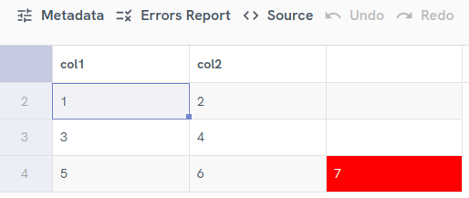
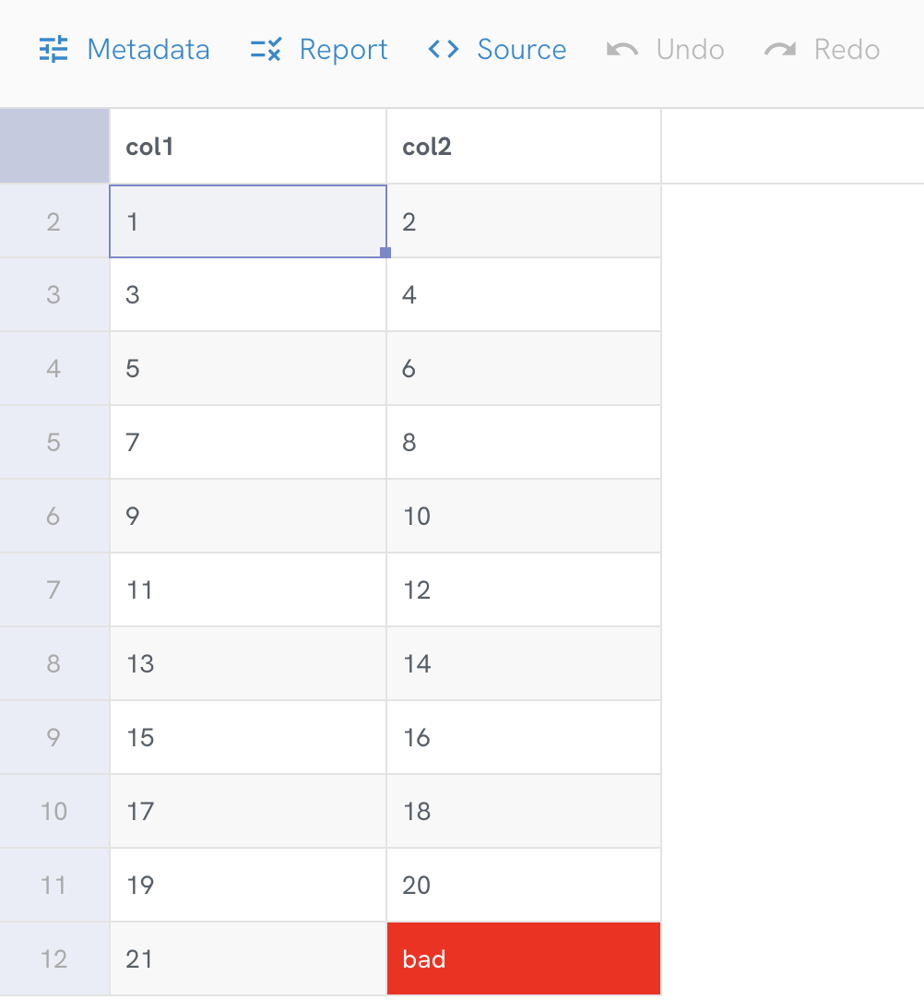

# Full list of table errors that the ODE detects

Here we describe the list of errors that the ODE can detect after users upload tables to the app. All the examples are based on CSV files.

:::note
It is possible to reproduce a subset of these errors using other formats like Excel, but some errors might not be applicable to other formats.
:::

To explain and understand errors, we need to illustrate some key elements that are part of tables:

- A regular table contains one **header row** (where names of columns are listed), **rows** and **cells**.
- **Cells describing names of columns** are also called **labels**.
- Rows contain **cells** called **values**.

Table example is represented as follows:

```
[1] [header row] label 1  | label 2
[2] [data row]   value 1  | value 2
[3] [data row]   value 3  | value 4
```

## Errors detected automatically

**This type of error occurs when the structure of the data is not as expected.** For example, the number of columns in a row is different from the number of columns in the header.

### Header missing

**This error occurs when the header row is empty**. The header row should contain the names of the columns:

```
,
1,2
3,4
```

[File to reproduce the error](../../../public/table-error-list/header-missing.csv)

This is how the ODE will show the error:



:::note
If the header row in the csv is completely empty this error won’t be reproduced as the ODE interprets that the header is in the second row.
For instance, if a user opens a csv with this structure:

```
1,2
3,4
```

The ODE will consider values 1 and 2 as column names.


:::

### Column name missing

**This error occurs when one or more column names are missing:**

```
col1,
1,2
3,4
```

[File to reproduce the error](../../../public/table-error-list/column-name-missing.csv)

This is how the ODE will show the error:


### Duplicate column name

This error occurs when there are two or more columns with the same name. Each column should have a unique name.

```
col1,col1
1,2
3,4
```

[File to reproduce the error](../../../public/table-error-list/duplicate-column-name.csv)

This is how the ODE will show the error:



### Empty Row

This error occurs when there is an empty row in the data.

```
col1,col2
1,2

3,4
```

[File to reproduce the error](../../../public/table-error-list/empty-row.csv)

This is how the ODE will show the error:



### Missing cell

This error occurs when a row has fewer cells than the header.

```
col1,col2
1,2
3,4
5
```

This is how the ODE will show the error:



### Extra cell

This error occurs when a row has more cells than the header. Each row should have the same number of cells as the header.

```
col1,col2
1,2
3,4
5,6,7
```

[File to reproduce the error](../../../public/table-error-list/extra-cell.csv)

This is how the ODE will show the error:



### Wrong data type

This error occurs when a cell contains a value that is not of the expected type. For example, a cell in a column that should contain numbers contains a string.

```
col1,col2
1,2
3,4
5,6
7,8
9,10
11,12
13,14
15,16
17,18
19,20
21,bad
```

[File to reproduce the error](../../../public/table-error-list/wrong-data-type.csv)

This is how the ODE will show the error:



:::note
Note: This error can be identified without providing a Table Schema but only if the data has enough cells of the correct type in the column to infer the intended type.
:::

## Errors Requiring Metadata

These errors can only be identified if a Table Dialect or Table Schema is provided by editing the table’s metadata. The Table Schema defines the structure of the data, including the type of each column. Table Schema adds additional constraints to the data, which are used to validate the data.

### Extra column name

This error occurs when there is a header label in the data that is not defined in the Table Schema. The Table Schema should define all the columns in the data.

```
fields:
  - name: col1
  - name: col2

col1,col2,col3
1,2
3,4

Cell col3 is an extra label
```

### Missing column name

This error occurs when there is a column defined in the Table Schema that is not present in the header row. The data should contain all the columns defined in the Table Schema.

```
fields:
  - name: col1
  - name: col2
  - name: col3

col1,col2
1,2,3
4,5,6

Missing cell col3 is a missing label.
```

### Incorrect column name

This error occurs when the header label in the data does not match the label defined in the Table Schema. The header row should contain the same labels as defined in the Table Schema.

```
fields:
  - name: col1
  - name: col2

col1,col3
1,2
3,4

Cell col3 is an incorrect label.
```

### Primary Key Error

This error occurs when the primary key constraint defined in the Table Schema is not satisfied. The primary key constraint ensures that the values in the specified columns are unique.

```
fields:
  - name: col1
  - name: col2

primaryKey: col1
col1,col2
1,2
1,4

Cell 1 in the second data row is not unique.
```

### Foreign Key Error

This error occurs when the foreign key constraint defined in the Table Schema is not satisfied. The foreign key constraint ensures that the values in the specified columns are present in another table or satisfies self-referencing constraint.

```
fields:
  - name: col1
  - name: col2
foreignKeys:
  - fields: col2
    reference:
      fields: col1

col1,col2
1,2
2,4

Cell 4 in the second data row is not present in the col1 column.
```

### Unique constraint error

This error occurs when the unique constraint defined in the Table Schema is not satisfied. The unique constraint ensures that the values in the specified columns are unique.

```
fields:
  - name: col1
  - name: col2
    unique: true

col1,col2
1,2
3,2

Cell 2 in the second data row is not unique.
```

### Constraint Error

This error occurs when a field constraint defined in the Table Schema is not satisfied.

Read more about Table Schema constraints: [https://datapackage.org/standard/table-schema/#field-constraints](https://datapackage.org/standard/table-schema/#field-constraints)

```
fields:
  - name: col1
  - name: col2
    constraints:
      - required: true

col1,col2
1,2
3

Missing cell 4 in the second data row is required.
```

The following constraints can be defined in the Table Schema and currently supported by Open Data Editor (please read the section above about unique constraint):

- required
- enum
- minimum
- maximum
- minLength
- maxLength
- pattern
