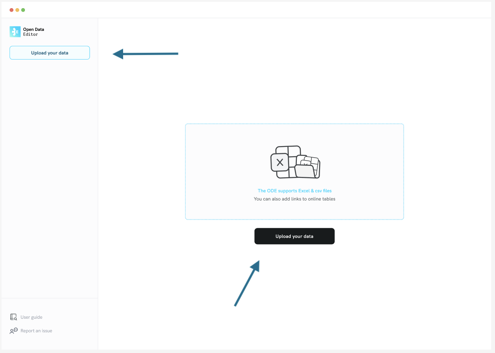
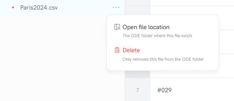
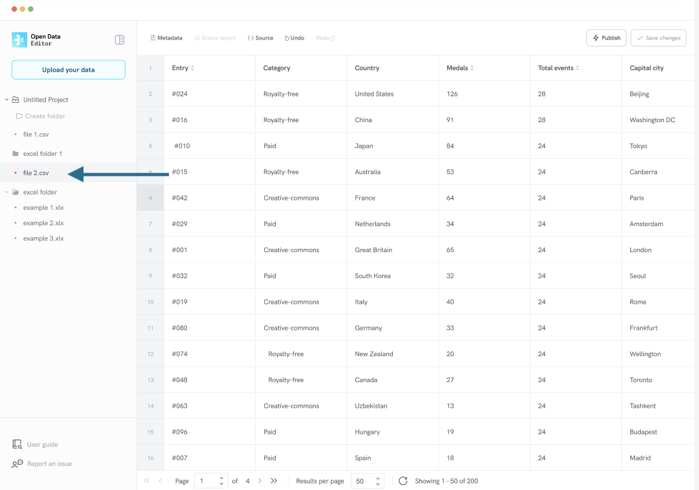
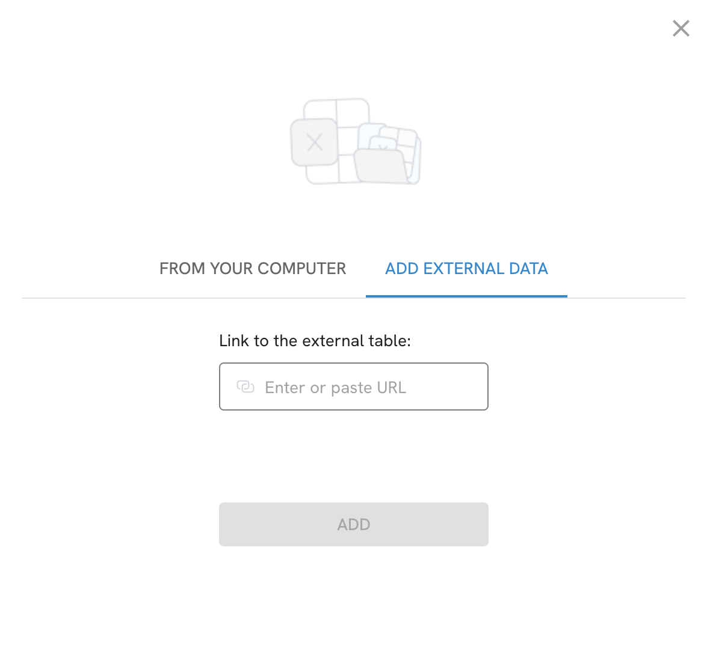

# Uploading data

This section explains how to upload tabular files, folders with tables and online data to the ODE. The tool also ingests other types of format files like PDF, JPEG, etc. However, take into account that, since the ODE main objective is to detect errors on tabular files, the application will **ONLY** show previews for tables.

**Uploading data to the ODE is easy!** After installing the app and once you open the application on your laptop, you will see this screen:

You can click on the **Upload your data** button, located in the centre of the screen or at the **top left** on the sidebar to start adding files/folders to the app.

:::{note}
Each time you upload a file or folder to the ODE, the application will not ingest the original file/folder from your computer. Instead, it will make a copy of it and add it to the application folder on your laptop. After the ingestion process ends, you can click on the **three dots** next to the name of the file/folder and select the **Open Location** option. By doing so, ODE will redirect you to the exact location where the copy was saved.
:::

## Excel, csv files and folders

When clicking on the **Upload your data** button the ODE will display the following dialog. If you want to upload files or folders, you can do so from the **From Your Computer** section. If you want to add tables that are online, you can do it from **Add external data**:

You will see there are two options available in the **From your computer** section. To add file/s, click **Select** on the **Add one or more Excel or Csv files** feature. If you want to ingest one or many folders, click Select on the **Add one or more folders** box.

Once the ingestion process concludes, the ODE will add your data on the sidebar of the app:

Note that while uploading your data the tool checks your files or folders to find errors according to the validation rules provided by [Frictionless](https://framework.frictionlessdata.io/). Please, check the [Full list of table errors that the ODE detects](/documentation/table-error-list) in this guide to learn more.

👉🏼 If your file has **NO ERRORS**, the ODE will add a green dot 🟢 before the name of your file.

👉🏼 If your file has **ERRORS**, the ODE will add a red dot 🔴 before the name of your file.

Please, keep in mind that since the preview section (datagrid) can only show one tabular file at the time, when uploading folders, and after the ingestion process is done, you will need to click on the folder and select the file you want to visualize on the screen. As soon as you click on a specific file, the ODE will start validating your data (looking for possible errors) and the table will be shown on the app.

:::{note}
If you ingest a non-tabular format (PDF or Word, for instance), the ODE will display this message on the main screen:

:::

### Tables published online

The ODE also allows users to upload online tables. You can upload files from open data portals, Google Sheets or tables from your GitHub repository.

To upload online tables, first click the **Upload your data** button and then select the **Add external data** section:

Now, write or paste the URL to the table. The ADD button will turn blue:

After that, the ODE will start reviewing your file in the background to detect possible errors and data will be displayed on the main screen.

:::{note}
Before you upload your online table…

👉🏼 If you are uploading a Google Sheets file, check the file is published online. If you don’t know how to do it, please, visit [this page](https://support.google.com/docs/answer/183965?hl=en&co=GENIE.Platform%3DDesktop) and follow the steps listed there.

👉🏼 For Google Sheets, please make sure you are adding the public version of your file without the HTML term at the end. For example:

✅ https://docs.google.com/spreadsheets/d/1dFVoF6f9VU5pjaGhyyvQaBN0n6ae-iLCtlvsO1N2jhA/edit?gid=0#gid=0

❌ https://docs.google.com/spreadsheets/d/e/2PACX-1vQ8w9yb7D-iYEbImb0WD4Kh53_Yp7H1VOi1bIMcicphWbkrrH9PobXCJhXt9frqyQ/pubhtml

👉🏼 When exporting a file from Google Sheets in csv and you have columns with numbers, please, make sure to use “.” for decimals, instead of commas. Otherwise, Frictionless, the code working behind the ODE will interpret the content of your cells with numbers as text.

For all tables…

👉🏼 Make sure your file is well-organized (well-formatted: each column must contain a name, there should be no extra rows before the table, or additional elements (like borders or lines) next to the space where the tabular data is located.

👉🏼 Check that the tabular data does not contain cells that are merged. Data producers from Governments, international organizations and internal reports usually add tiles, descriptions, graphs within sheets, like in this case. If there are extra elements in your file, the ODE will ingest your file and show you multiple errors.
:::
