# User Guide {#user-guide}

## Downloading ODE {#downloading-ode}

Open Data Editor is available on all major platforms:

* **For Windows:** Download the most recent **EXE file**.  
* **For MacOS:** Download the most recent **DMG file**.  
* **For Debian-based Linux:** Download the most recent **AppImage or DEB file**.  
* **For other Linux:** Download the most recent **AppImage**.

### From our website {#from-our-website}

You can download ODE from our website: [https://okfn.org/opendataeditor/](https://okfn.org/opendataeditor/) 

### From GitHub Releases {#from-github-releases}

You can download ODE from the repository: [https://github.com/okfn/opendataeditor/releases](https://github.com/okfn/opendataeditor/releases) 

## Installing ODE {#installing-ode}

### Windows {#windows}

Download the most recent **EXE** file as per the above instructions.

1\. If you receive the following message, click ‘Continue download’.

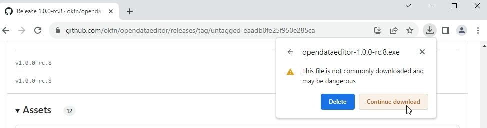

2\. After downloading, double-click to run the app. You may encounter the security message window, click ‘More info’ and proceed.

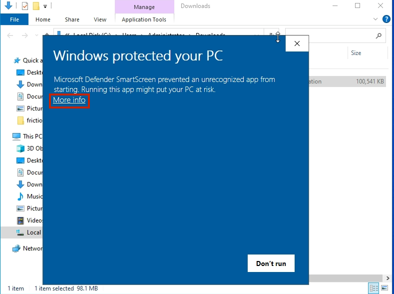

3\. Click ‘Run anyway’ to run the application.

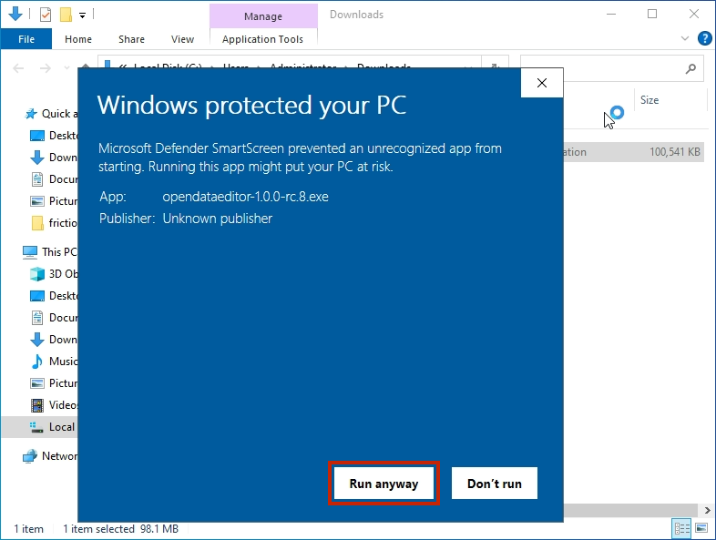

### MacOS {#macos}

Download the most recent **DMG** file as per the above instructions.

1\. If you encounter a security message, click on the question mark and then click the link in the first section.

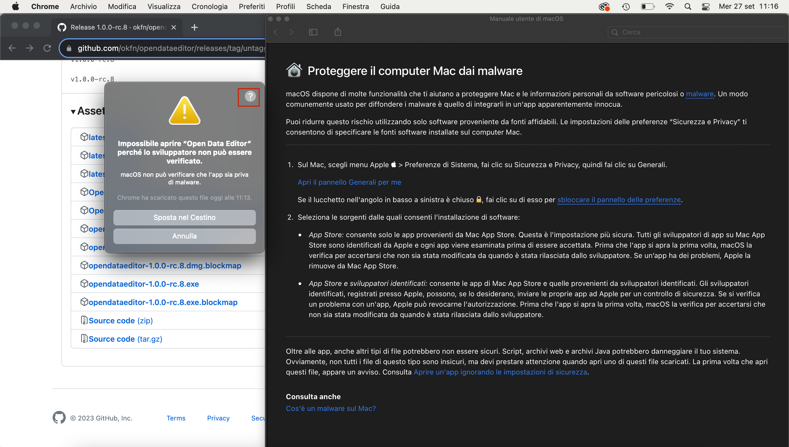

2\. Change settings to allow the app to execute.

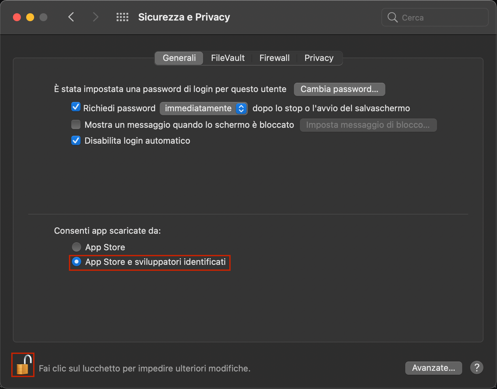

### Linux {#linux}

For Linux, there are two options available:

* AppImage (for any distributions)  
* deb (for Ubuntu/Debian)

#### Any Distribution {#any-distribution}

Download the most recent **AppImage** file as per the above instructions.

After downloading, you have to make it executable:

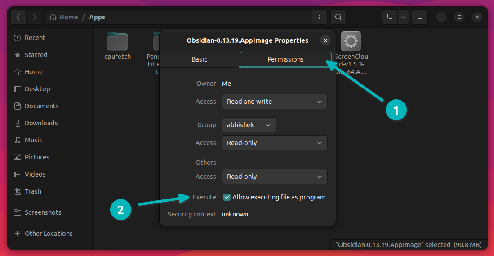

Then double-click on the file to start the application.

#### Ubuntu/Debian {#ubuntu/debian}

Download the most recent **DEB** file as per the above instructions.

Double-click on the file, and it will initiate the installation process.

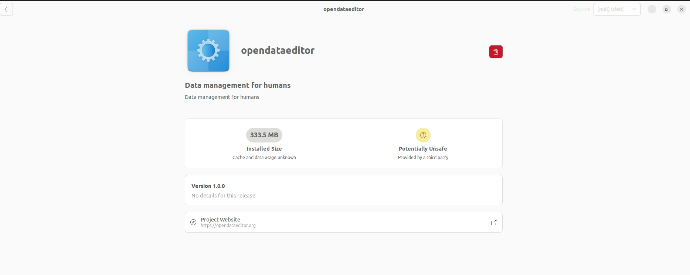

After installation, you can use it.

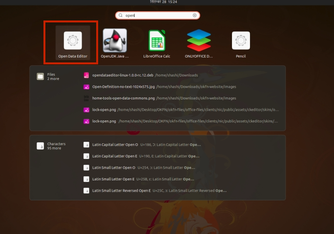

Optionally, in Debian, you can install it by running the following command:

*\# Replace \<version\> with the version you downloaded*  
sudo dpkg \-i opendataeditor-linux-\<version\>.deb

## Uploading data {#uploading-data}

This section explains how to upload tabular files, folders with tables and online data to ODE. The tool also ingests other types of format files like PDF, JPEG, etc. However, please note, ODE's main objective is to detect errors on tabular files, the application will **ONLY** show previews for tables.

**Uploading data to ODE is easy\!** After installing the app and once you open the application on your laptop, you will see this screen:

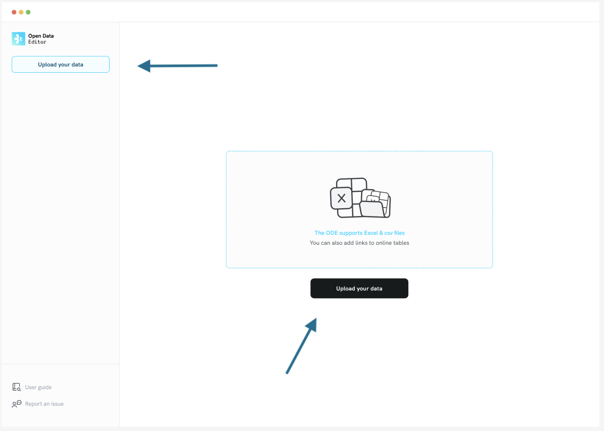

You can click on the **Upload your data** button, located in the centre of the screen or at the top left of the sidebar, to start adding files/folders to the app.

:::{note} 
Each time you upload a file or folder to ODE, the application will not ingest the original file/folder from your computer. Instead, it will make a copy of it and add it to the application folder on your laptop. After the ingestion process ends, you can right-click on the file/folder and select the **Open Location** option. By doing so, ODE will redirect you to the exact location where the copy was saved. 
:::

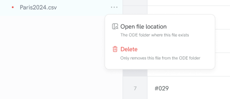

### Excel, CSV files and folders {#excel,-csv-files-and-folders}

When clicking on the **Upload your data** button, ODE will display the following dialogue. If you want to upload files or folders, you can do so from the **From Your Computer** section. If you want to add tables that are online, you can do it from **Add External Data**:

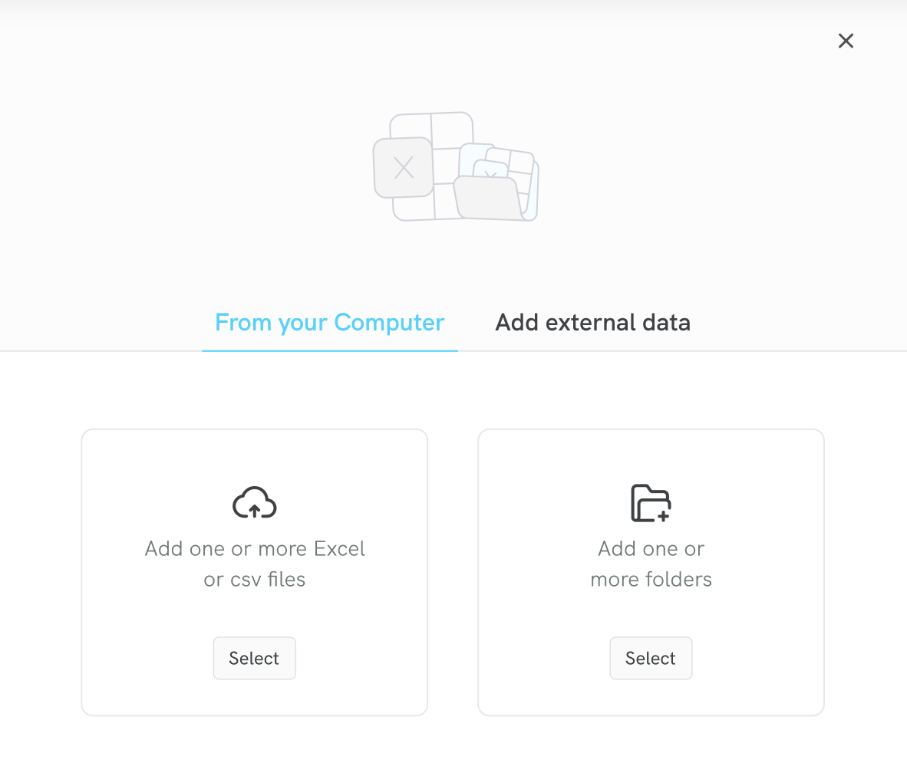

You will see there are two options available in the **From your computer** section. To add file/s, click **Select** on the **Add one or more Excel or csv files** feature. If you want to ingest one or many folders, click Select on the **Add one or more folders** box.

Once the ingestion process concludes, ODE will add your data to the sidebar of the app:

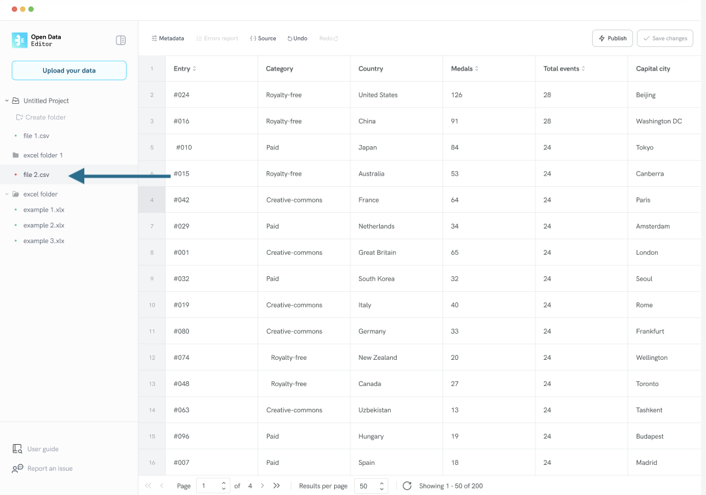

Note that while uploading your data, the tool checks your files or folders to find errors according to the validation rules provided by [Frictionless](https://framework.frictionlessdata.io/). Please, check the **Full list of table errors detected** in this guide to learn more.

Please keep in mind that since the preview section (datagrid) can only show one tabular file at a time, when uploading folders, and after the ingestion process is done, you will need to click on the folder and select the file you want to visualise on the screen. As soon as you click on a specific file, ODE will start validating your data (looking for possible errors), and the table will be shown on the app.

#### Tables published online {#tables-published-online}

ODE also allows users to upload online tables. You can upload files from open data portals, Google Sheets or tables from your GitHub repository.

To upload online tables, first click the **Upload your data** button and then select the **Add External Data** section:

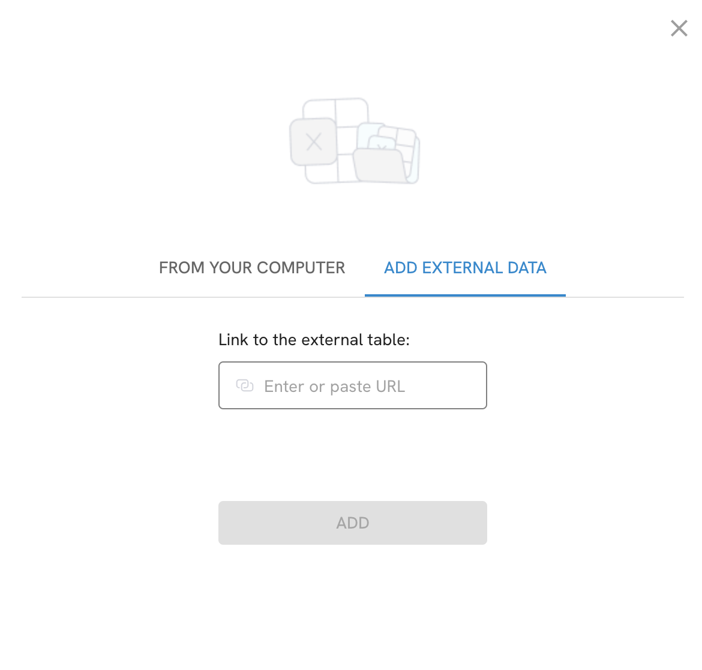

Now, write or paste the URL to the table and click the **Add** button:

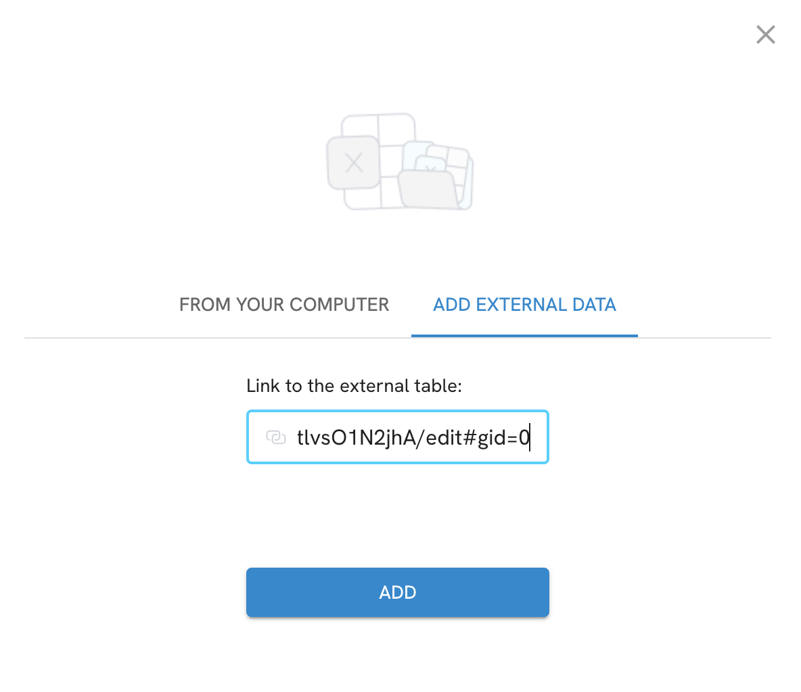

After that, ODE will start reviewing your file in the background to detect possible errors, and data will be displayed on the main screen.

:::{note}
Before you upload your online table…

👉🏼 If you are uploading a Google Sheets file, check that the file is published online. If you don’t know how to do it, please visit [this page](https://support.google.com/docs/answer/183965?hl=en&amp;co=GENIE.Platform%3DDesktop) and follow the steps listed there.

👉🏼 For Google Sheets, please make sure you are adding the public version of your file without the HTML term at the end. For example:

✅ https://docs.google.com/spreadsheets/d/1dFVoF6f9VU5pjaGhyyvQaBN0n6ae-iLCtlvsO1N2jhA/edit?gid=0\#gid=0

❌ https://docs.google.com/spreadsheets/d/e/2PACX-1vQ8w9yb7D-iYEbImb0WD4Kh53\_Yp7H1VOi1bIMcicphWbkrrH9PobXCJhXt9frqyQ/pubhtml

👉🏼 When exporting a file from Google Sheets in CSV and you have columns with numbers, please make sure to use “.” for decimals, instead of commas. Otherwise, Frictionless, the code working behind ODE will interpret the content of your cells with numbers as text.

For all tables…

👉🏼 Make sure your file is well-organised (well-formatted: each column must contain a name, there should be no extra rows before the table, or additional elements (like borders or lines) next to the space where the tabular data is located.

👉🏼 Check that the tabular data does not contain cells that are merged. Data producers from Governments, international organizations and internal reports usually add tiles, descriptions, and graphs within sheets, like in this case. If there are extra elements in your file, ODE will ingest your file and show you multiple errors. 
:::

## How to explore table errors {#how-to-explore-table-errors}

As mentioned in the **Uploading data** section in this guide, if a file has errors, ODE will show a red dot next to the file name on the sidebar. However, if you want to review errors in the table, you can use the datagrid to explore problematic data.

ODE will highlight the cell in red if it has a problem. For instance, if it contains text instead of a number.

This is how a cell with an error is shown on ODE:

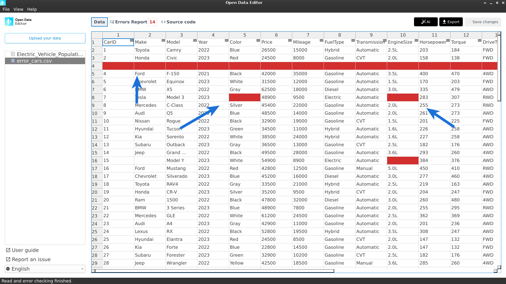

You can also explore errors by clicking on the **Errors Report** button, located at the top left of the datagrid:

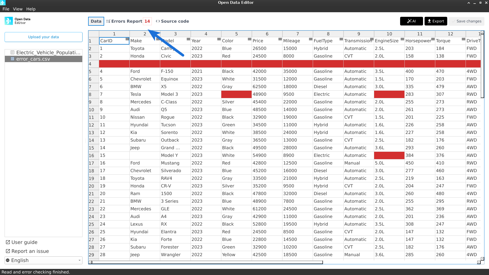

After clicking the button, ODE will display a panel with the full list of errors:

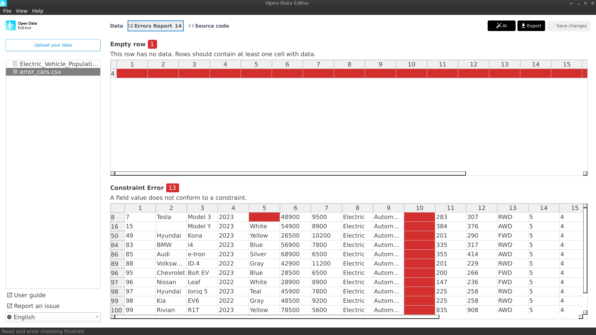

## Editing errors in tables {#editing-errors-in-tables}

To fix cell errors, you can directly edit the data cells in the viewer/editor.

**Step 1:** Locate the cell with the error. For example:

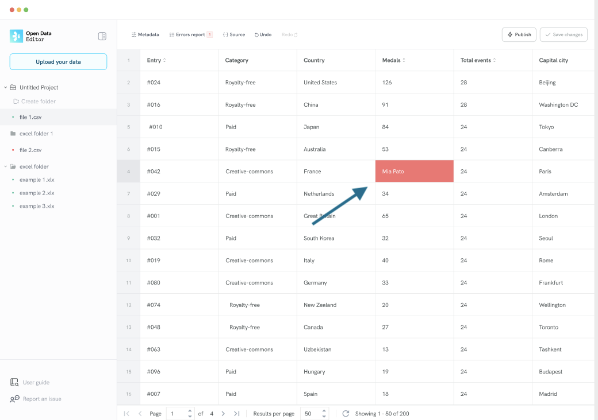

**Step 2:** Double-click on the cell to start editing content:

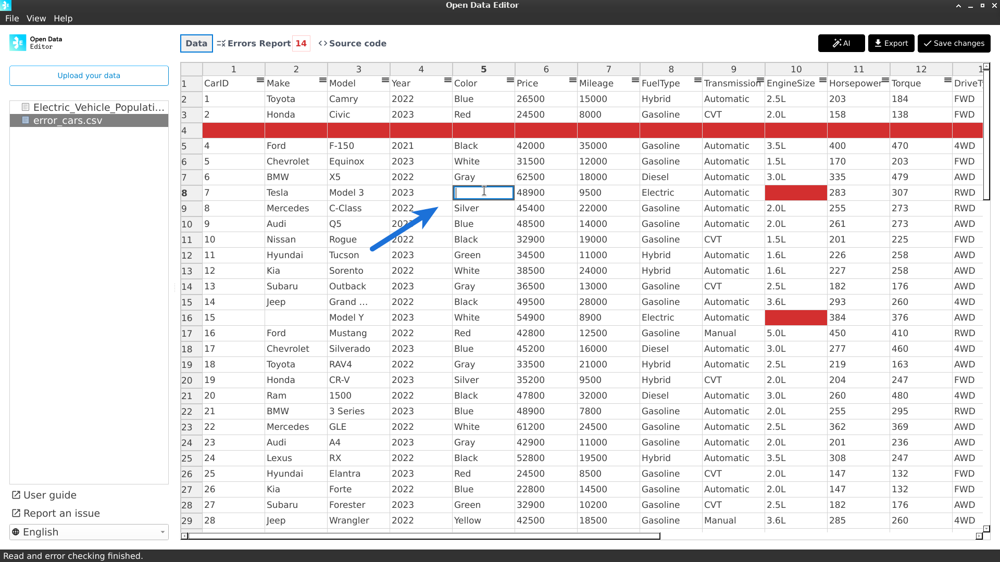

**Step 3:** To save changes, click on another part of the table to accept the change in the cell, and when the **Save changes** button is activated, click on it. The button will get activated if there are unsaved changes.

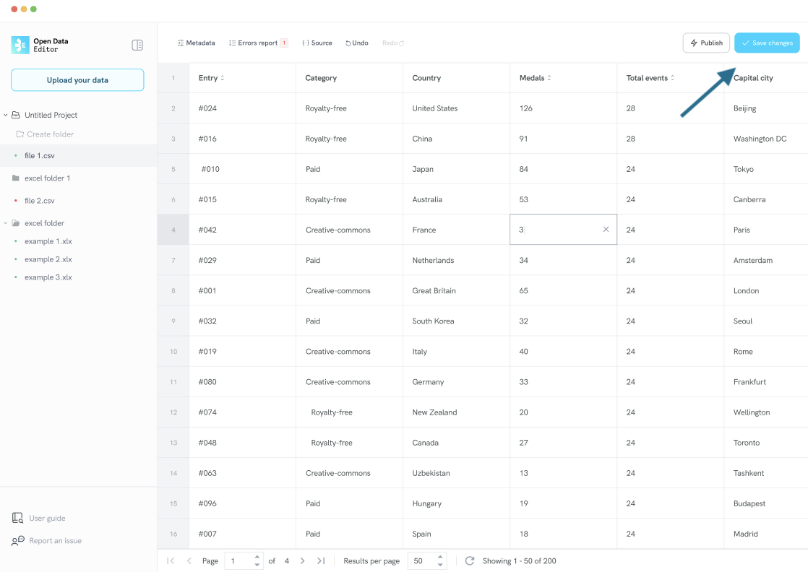

After clicking the **Save changes** button, ODE will update the Errors Report.

## Deleting files or folders {#deleting-files-or-folders}

To delete a file or folder, click on the three dots next to the file/folder name and select **Delete**.

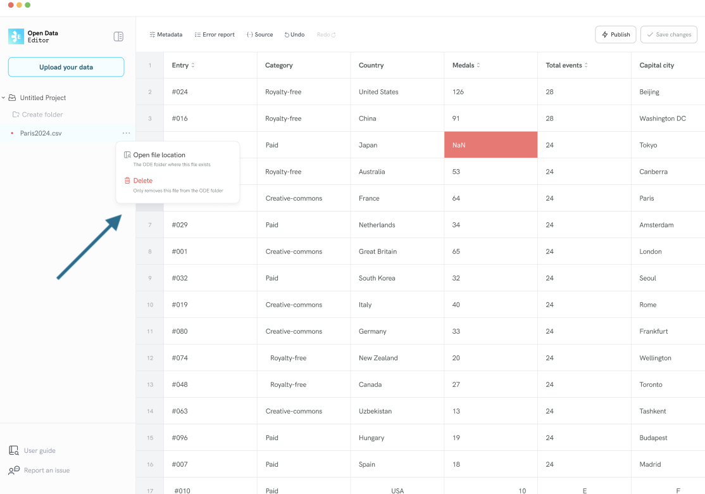

## Full list of table errors detected {#full-list-of-table-errors-detected}

Here we describe the list of errors that ODE can detect after users upload tables to the app. All the examples are based on CSV files.

:::{note} 
It is possible to reproduce a subset of these errors using other formats like Excel, but some errors might not be applicable to other formats. 
:::

To explain and understand errors, we need to illustrate some key elements that are part of tables:

* A regular table contains one **header row** (where the names of columns are listed), **rows** and **cells**.  
* **Cells describing names of columns** are also called **labels**.  
* Rows contain **cells** called **values**.

The table example is represented as follows:

```
[1] [header row] label 1  | label 2
[2] [data row]   value 1  | value 2
[3] [data row]   value 3  | value 4
```

### Errors detected automatically {#errors-detected-automatically}

**This type of error occurs when the structure of the data is not as expected.** For example, the number of columns in a row is different from the number of columns in the header.

#### Header missing (Blank Label) {#header-missing-(blank-label)}

This error occurs when the **header row is empty**. The header row should contain the names of the columns:

```
,
1,2
3,4
```

* [Reproduce the error using this file](https://opendataeditor.okfn.org/_downloads/bb8d52a4fb7cb7ce135cda4ac8156173/header-missing.csv)

This is how ODE will show the error:

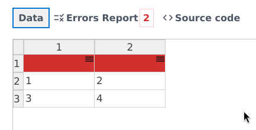

#### Column name missing {#column-name-missing}

This error occurs when **one or more column names are missing**:

```
col1,
1,2
3,4
```

* [Reproduce the error using this file](https://opendataeditor.okfn.org/_downloads/45ba64a900f79509f76ef9865da818fe/column-name-missing.csv)

This is how ODE will show the error:

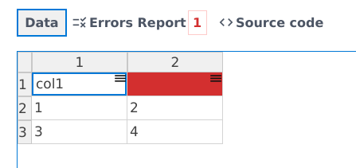

#### Duplicate column name {#duplicate-column-name}

This error occurs when there are **two or more columns with the same name**. Each column should have a unique name.

```
col1,col1
1,2
3,4
```

* [Reproduce the error using this file](https://opendataeditor.okfn.org/_downloads/c352eb003acbc2caf2f45df0d37631c9/duplicate-column-name.csv)

This is how ODE will show the error:

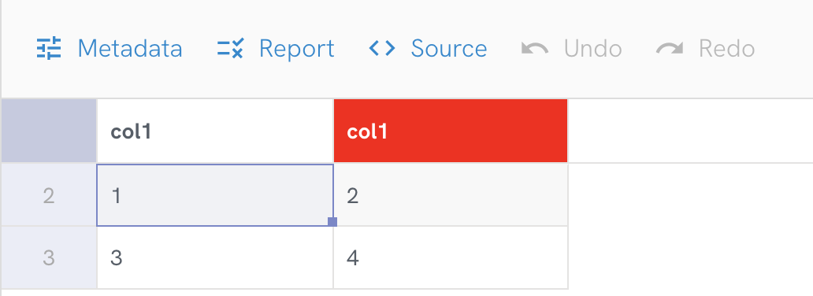

#### Empty row {#empty-row}

This error occurs when an **empty row is present in the data**.

```
col1,col2
1,2

3,4
```

* [Reproduce the error using this file](https://opendataeditor.okfn.org/_downloads/4cd0ff415190ada70a6cf765842f7aff/empty-row.csv)

This is how ODE will show the error:

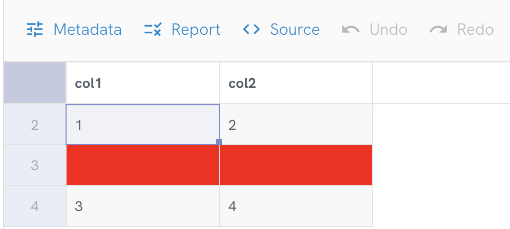

#### Missing cell {#missing-cell}

This error occurs when **a row has fewer cells than the header**.

```
col1,col2
1,2
3,4
5
```

This is how ODE will show the error:

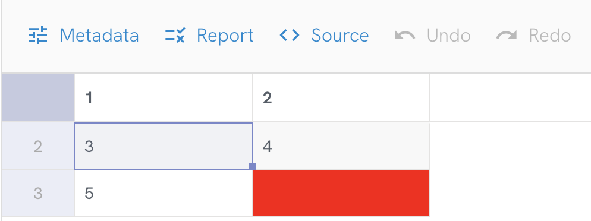

#### Extra cell {#extra-cell}

This error occurs when a row has more cells than the header. Each row should have the same number of cells as the header.

```
col1,col2
1,2
3,4
5,6,7
```

* [Reproduce the error using this file](https://opendataeditor.okfn.org/_downloads/1c7d6743ad084bf1dbe1de05b961e158/extra-cell.csv)

This is how ODE will show the error:

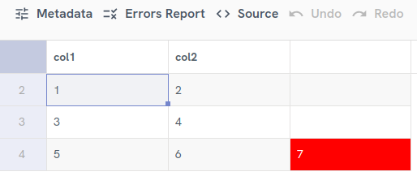

#### Wrong data type {#wrong-data-type}

This error occurs when **a cell contains a value that is not of the expected type**. For example, a cell in a column that should contain numbers contains a string.

```
col1,col2
1,2
3,4
5,6
7,8
9,10
11,12
13,14
15,16
17,18
19,20
21,bad
```

* [Reproduce the error using this file](https://opendataeditor.okfn.org/_downloads/508223106a8c55b55430211419875f01/wrong-data-type.csv)

This is how ODE will show the error:

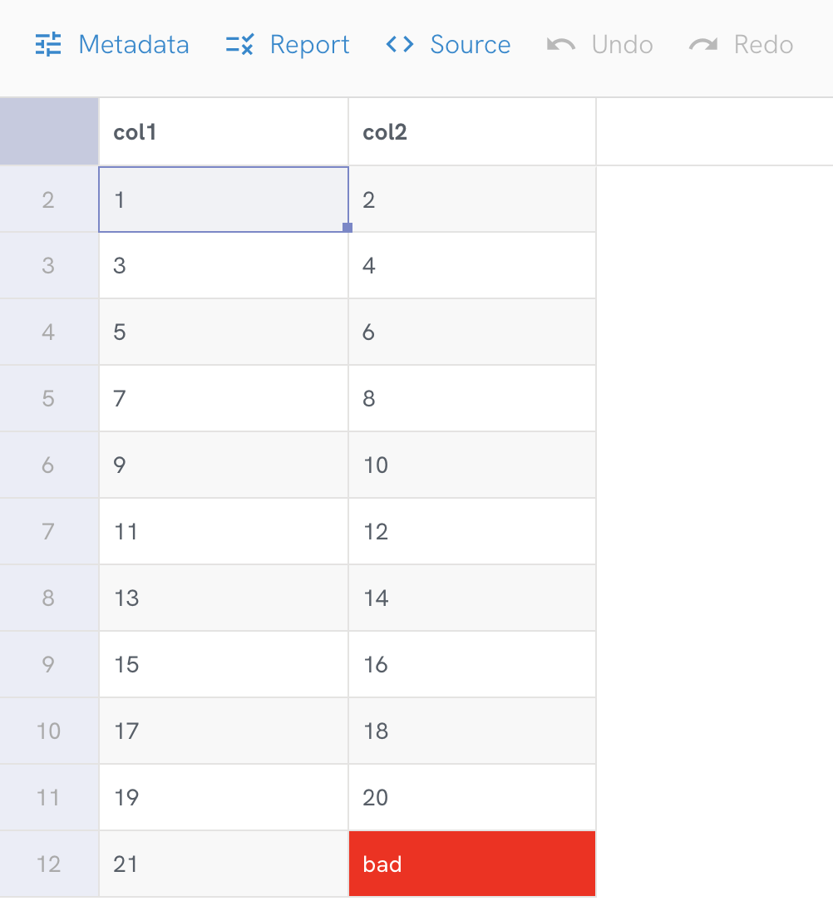

:::{note}
This error can be identified without providing a Table Schema, but only if the data has enough cells of the correct type in the column to infer the intended type. :::

### Errors Requiring Metadata {#errors-requiring-metadata}

These errors can only be identified if a Table Dialect or Table Schema is provided by editing the table’s metadata. The Table Schema defines the structure of the data, including the type of each column. Table Schema adds additional constraints to the data, which are used to validate the data.

#### Extra column name {#extra-column-name}

This error occurs when **a header label in the data is not defined in the Table Schema**. The Table Schema should define all the columns in the data.

```
fields:
  - name: col1
  - name: col2

col1,col2,col3
1,2
3,4

Cell col3 is an extra label
```

#### Missing column name {#missing-column-name}

This error occurs when **a column defined in the Table Schema is not present in the header row**. The data should contain all the columns defined in the Table Schema.

```
fields:
  - name: col1
  - name: col2
  - name: col3

col1,col2
1,2,3
4,5,6

Missing cell col3 is a missing label.
```

#### Incorrect column name {#incorrect-column-name}

This error occurs when **the header label in the data does not match the label defined in the Table Schema**. The header row should contain the same labels as defined in the Table Schema.

```
fields:
  - name: col1
  - name: col2

col1,col3
1,2
3,4

Cell col3 is an incorrect label.
```

#### Primary Key Error {#primary-key-error}

This error occurs when the **primary key constraint defined in the Table Schema is not satisfied**. The primary key constraint ensures that the values in the specified columns are unique.

```
fields:
  - name: col1
  - name: col2

primaryKey: col1
col1,col2
1,2
1,4

Cell 1 in the second data row is not unique.
```

#### Foreign Key Error {#foreign-key-error}

This error occurs when the **foreign key constraint defined in the Table Schema is not satisfied**. The foreign key constraint ensures that the values in the specified columns are present in another table or satisfies self-referencing constraint.

```
fields:
  - name: col1
  - name: col2
foreignKeys:
  - fields: col2
    reference:
      fields: col1

col1,col2
1,2
2,4

Cell 4 in the second data row is not present in the col1 column.
```

#### Unique constraint error {#unique-constraint-error}

This error occurs when the **unique constraint defined in the Table Schema is not satisfied**. The unique constraint ensures that the values in the specified columns are unique.

```
fields:
  - name: col1
  - name: col2
    unique: true

col1,col2
1,2
3,2

Cell 2 in the second data row is not unique.
```

#### Constraint Error {#constraint-error}

This error occurs when **a field constraint defined in the Table Schema is not satisfied**.

Read more about Table Schema constraints: [https://datapackage.org/standard/table-schema/\#field-constraints](https://datapackage.org/standard/table-schema/#field-constraints) 

```
fields:
  - name: col1
  - name: col2
    constraints:
      - required: true

col1,col2
1,2
3

Missing cell 4 in the second data row is required.
```

The following constraints can be defined in the Table Schema and are currently supported by Open Data Editor (please read the section above about unique constraints):

- required
- enum
- minimum
- maximum
- minLength
- maxLength
- pattern

## How to use the AI component {#how-to-use-the-ai-component}

To use the AI assistant, select a file from the sidebar, and then click on the **AI** button located in the top right corner of the app:

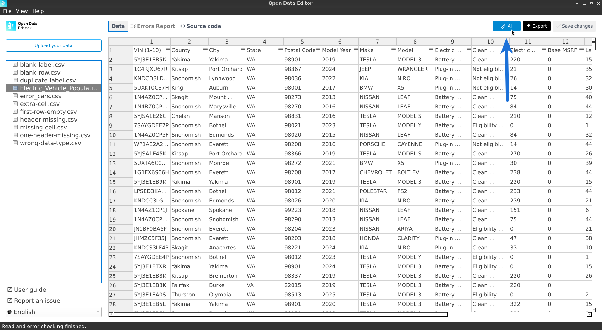

ODE will show a dialogue to assist the user in downloading the model:

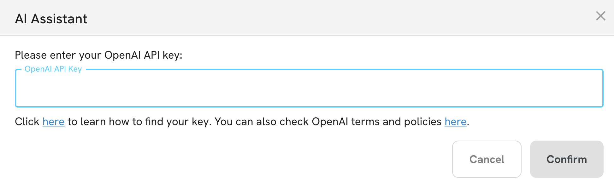

Once the model is downloaded, users will be able to click on the **Next** button to continue.

### AI Use Cases {#ai-use-cases}

ODE has two use cases for the AI component:

1. Assist users in understanding the columns of a table.  
2. Suggest analysis and questions that users can use to query the data.

To choose the use case, select it from the dropdown menu.

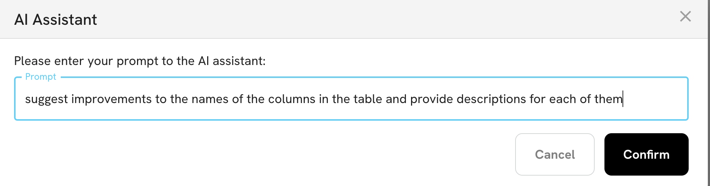

Once selected, click on the **Execute** button to get a response from the AI model.

:::{note}
Depending on the hardware of the users’ machines, the response time can vary. Usually, it will take around 10 seconds to get a response. :::

#### Assist users in understanding the columns of a table {#assist-users-in-understanding-the-columns-of-a-table}

The AI model will analyse the columns’ names, types and some sample data and will generate a description of each column. This is useful to understand the data better, clarify technical or complex names, expand acronyms, etc.

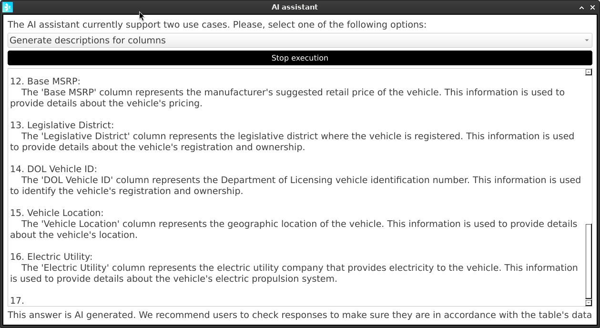

#### Suggest analysis and questions that users can use to query the data {#suggest-analysis-and-questions-that-users-can-use-to-query-the-data}

The AI model will analyse the columns’ names, types and some sample data and will generate a list of questions that the user can use to query the data.

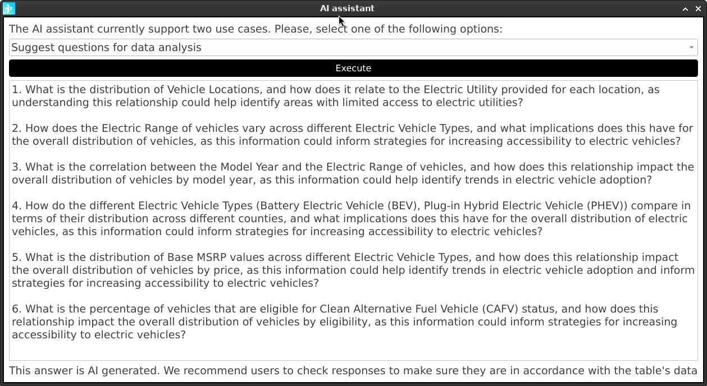

## How to explore and edit metadata {#how-to-explore-and-edit-metadata}

To explore or edit the metadata, select a file from the menu on the left and click on any cell of the header row (first row).

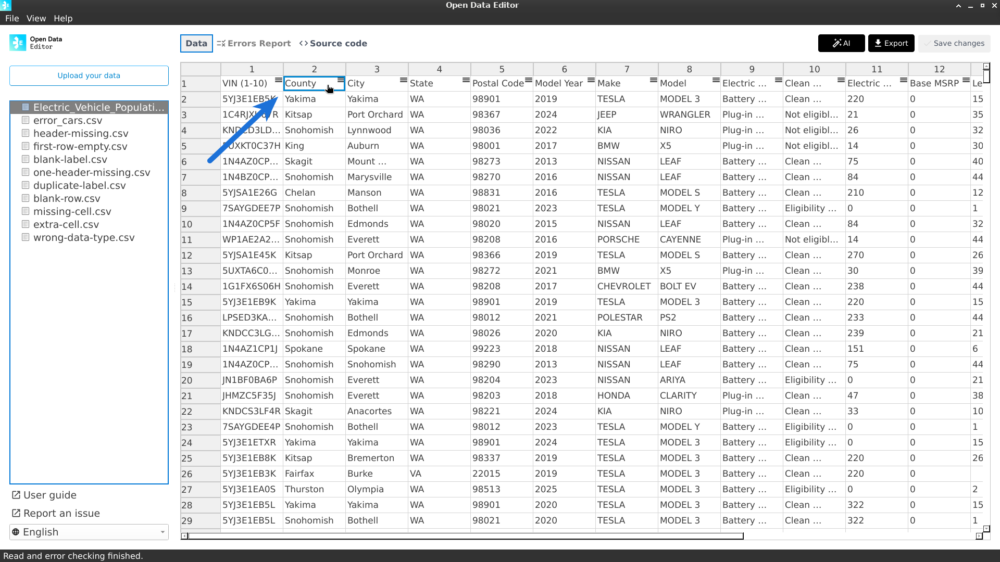

ODE will then display the **Metadata** window:

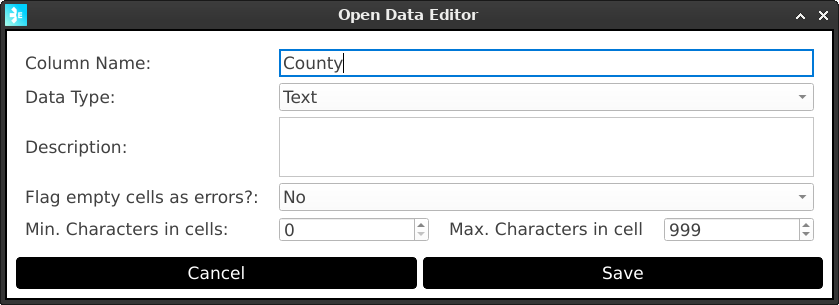

You can click on any of the options to start editing the metadata linked to your file.

Once you have finished editing the metadata, click on the **Save changes** button to save the changes.

:::{note} 
Saving changes will trigger a validation of the file. 
:::

## Exporting your data {#exporting-your-data}

You can export your data using the **Export** feature located at the top right of the datagrid:

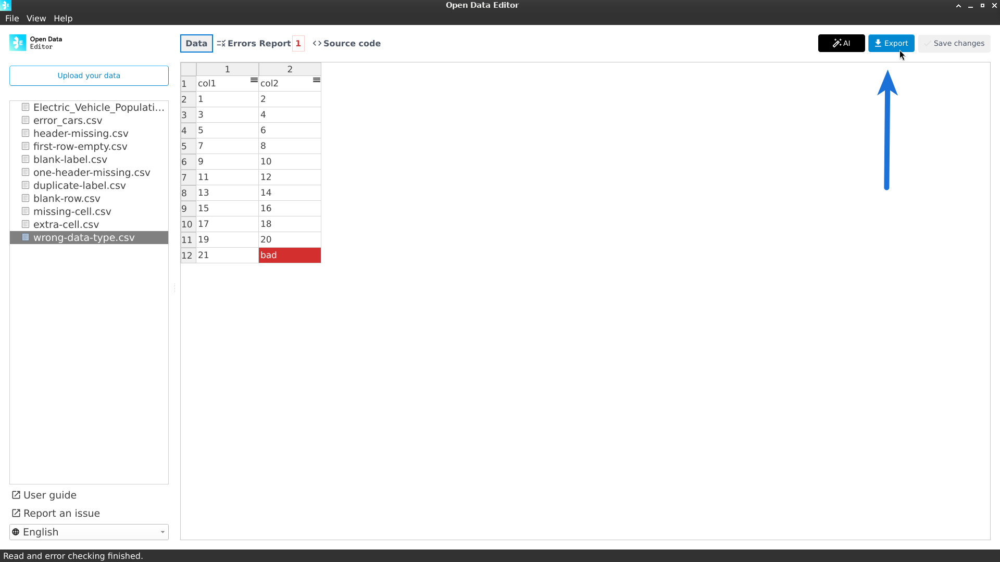

Once you click the **Export** button, ODE will display the following dialogue:

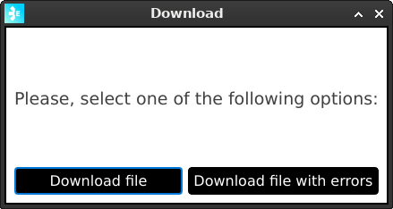

### Download file {#download-file}

This option will download the file in CSV format.

### Download file with errors {#download-file-with-errors}

This option will export an Excel file with three sheets:

* **Data:** This sheet contains the original table with all the errors painted in red.  
* **Errors Description:** This sheet contains the description of the errors detected by ODE with the corresponding cell (row and column).  
* **Blank Rows:** This sheet contains the rows on the original table that did not contain any values.