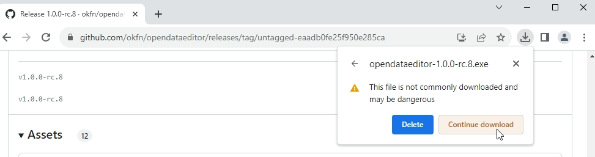
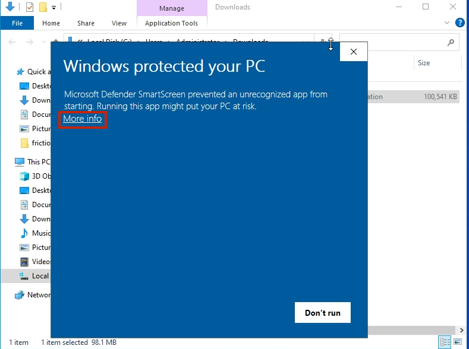
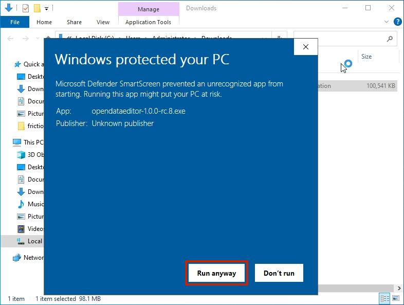
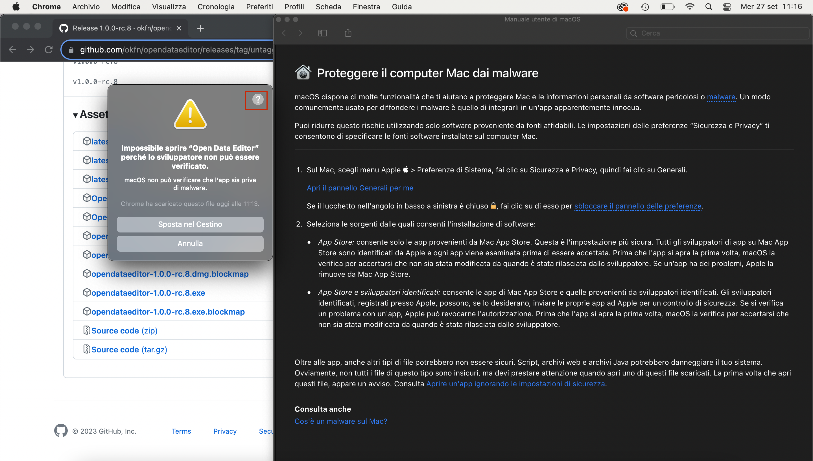
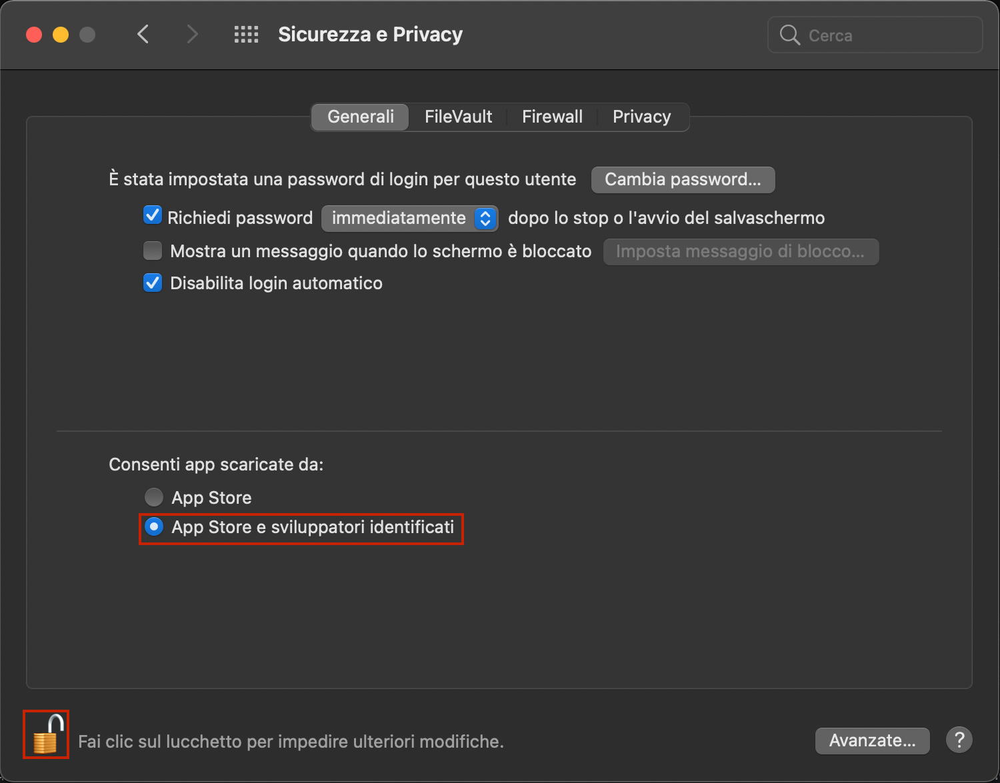
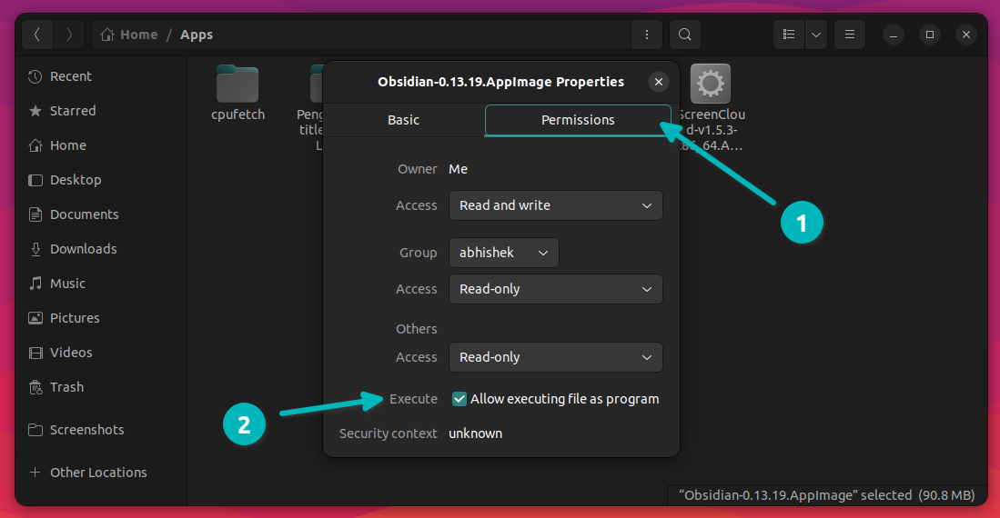
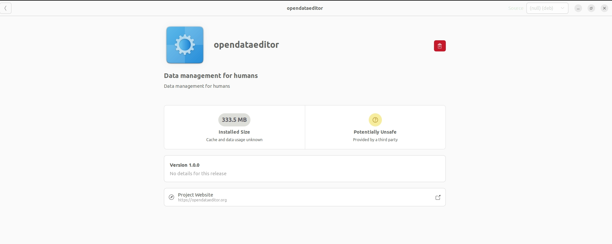
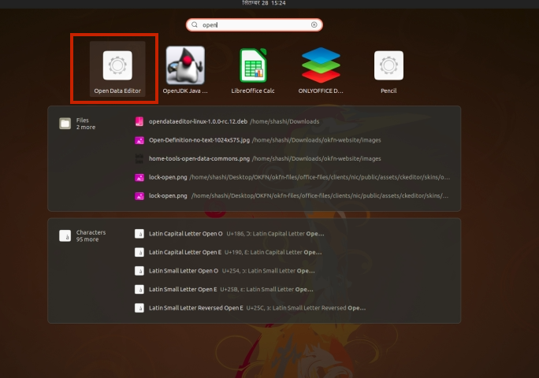

# Welcome!

The Open Data Editor (ODE) is a tool for non-technical data practitioners to explore and detect errors in tables.

ODE is powered by [Frictionless](https://framework.frictionlessdata.io/), a toolkit created by the Open Knowledge Foundation (OKFN) to help data practitioners find errors in data in an easier way.

This project was possible thanks to the support of [McGovern Foundation](https://www.mcgovern.org/).

## How to download and install the app

Open Data Editor is available on all major platforms:
- **For Windows**: Download the most recent **EXE file**.
- **For MacOS**: Download the most recent **DMG file**.
- **For Debian based Linux**: Download the most recent **AppImage or DEB file**.
- **For other Linux**: Download the most recent **AppImage**.

### From our website
You can download the ODE app from our website: [https://okfn.org/en/projects/open-data-editor/](https://okfn.org/en/projects/open-data-editor/)

### From GitHub Releases
To download the ODE app, please, [click here](https://github.com/okfn/opendataeditor/releases)

## Windows

Download the most recent **EXE** file as per above instructions.

1. If you receive the following message click `Continue download`



2. After downloading, double click to run the app. You may encounter the security message window, click `More info` and proceed.



3. Click `Run anyway` to run the application.



## MacOS

Download the most recent **DMG** file as per above instructions.

1. If you encounter a security message, click on the question mark and then click the link in the first section.



2. Change settings to allow the app to execute.



## Linux

For Linux, there are two options available:

- AppImage (for any distributions)
- deb (for Ubuntu/Debian)

### Any Distribution

Download the most recent **AppImage** file as per above instructions.

After downloading, you have to make it executable:



Then double-click on the file to start the application.

### Ubuntu/Debian

Download the most recent **DEB** file as per above instructions.

Double click on the file and it will initiate the installation process.



After installation, you can use it.



Optionally, in Debian you can install it by running the following command:

```bash
# Replace <version> with the version you downloaded
sudo dpkg -i opendataeditor-linux-<version>.deb
```
