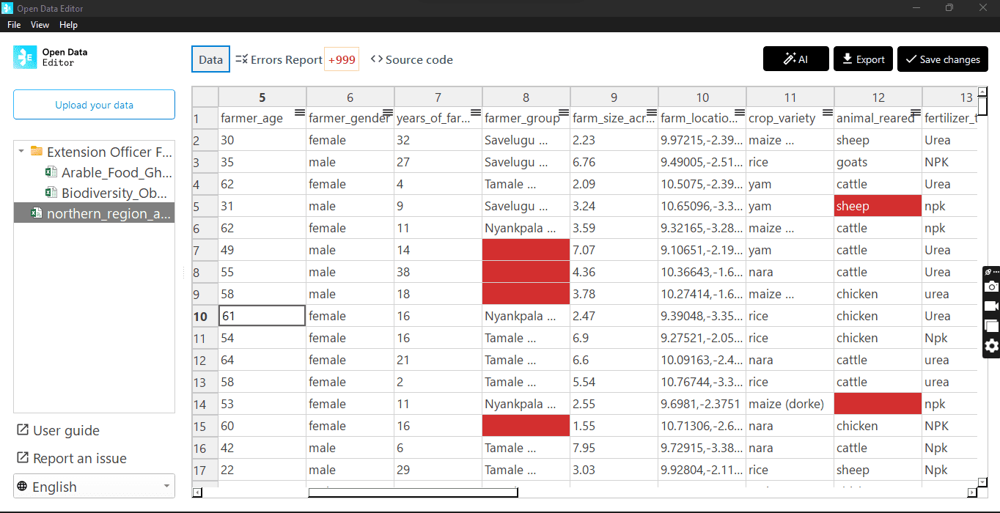
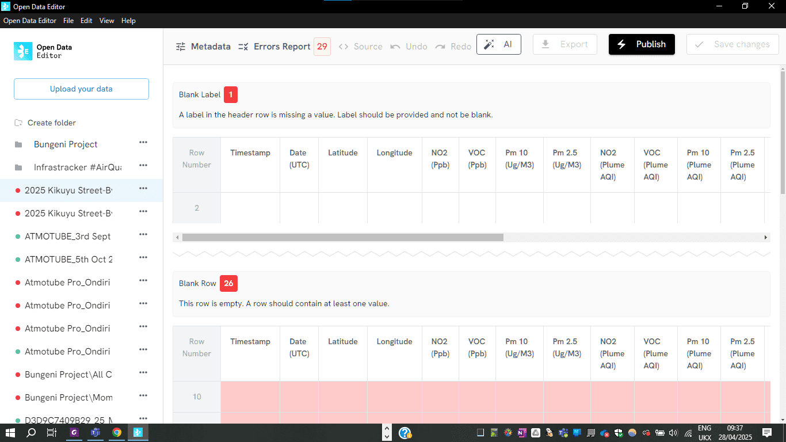
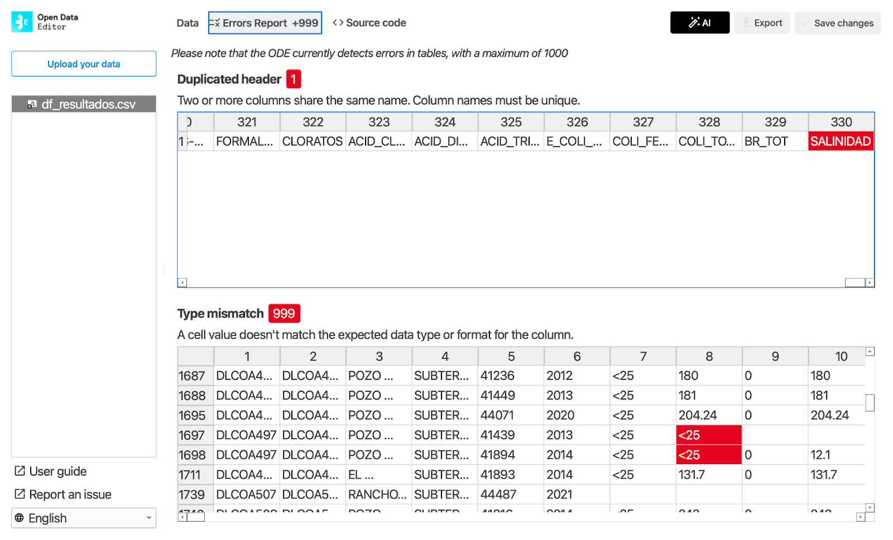
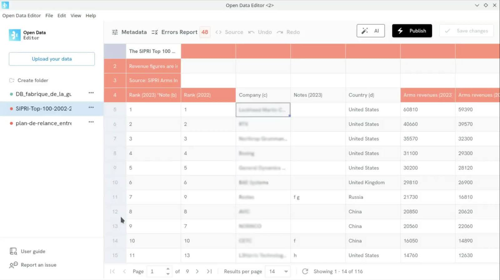
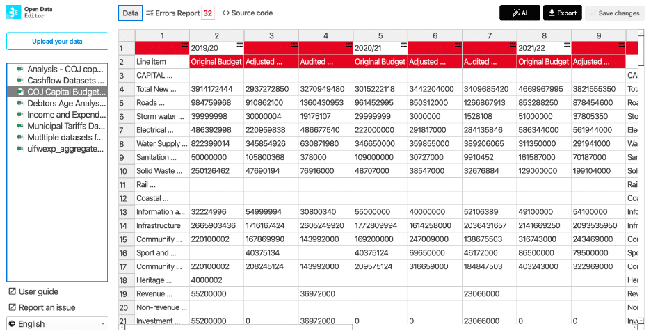
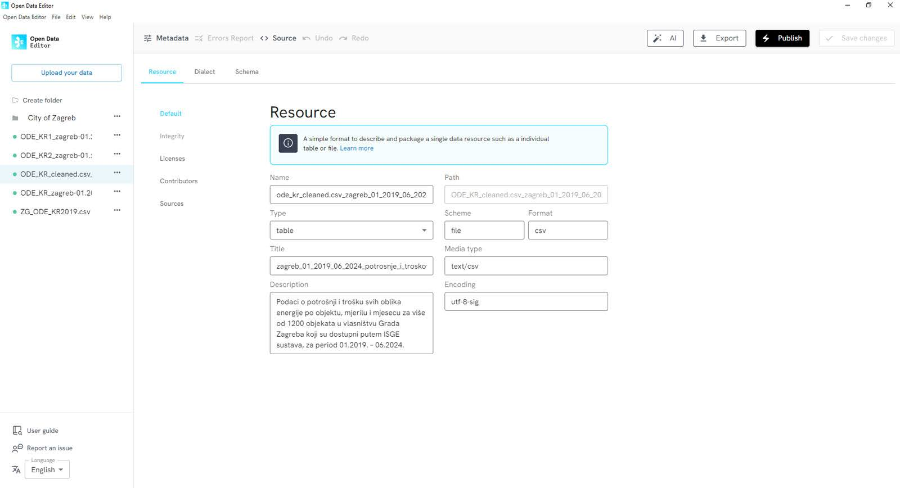
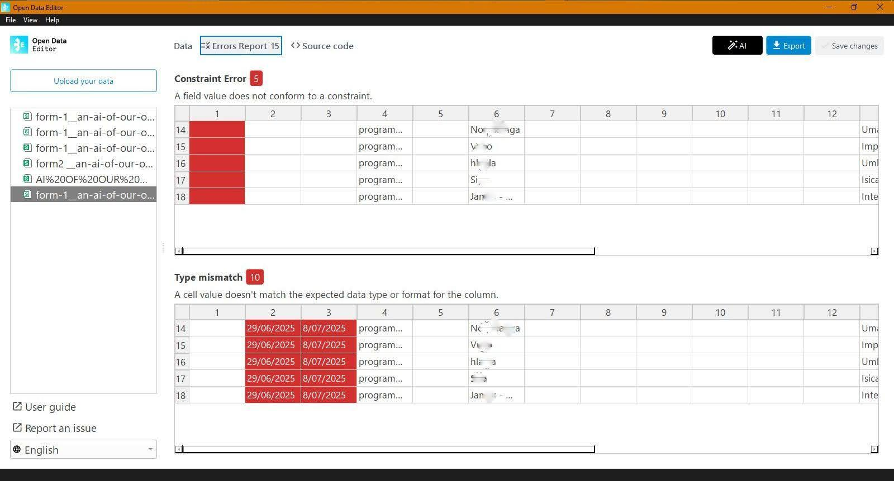
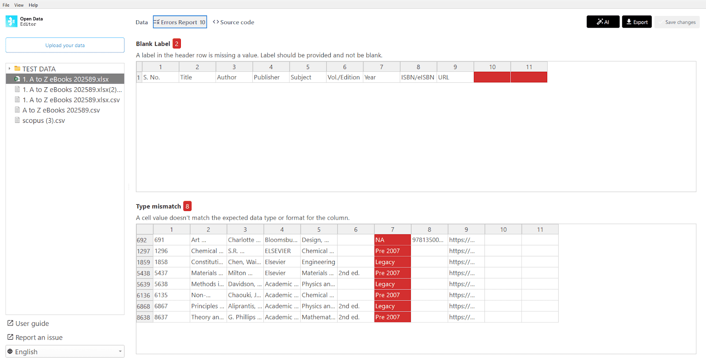

# Use Cases

The Open Data Editor was developed in collaboration with user communities worldwide. Between 2024 and 2025, three formal testing and feedback phases were conducted with civil society organisations working in different fields of knowledge. This work has given rise to several use cases, all of which are compiled here: [https://blog.okfn.org/tag/ode-use-cases/](https://blog.okfn.org/tag/ode-use-cases/) 

Below, we highlight some of them to give you an idea of the types of tasks that ODE helps to perform to improve data workflow and data quality.

You can also contribute by documenting a use case. Learn how at **Documentation \> Use cases** in this guide.

## Agricultural data (Ghana)

Open Science Community Ghana (OSCG) used ODE to streamline the work with manually-collected data and reduce the time to identify and correct errors. 

The ODE interface enabled the team to easily define and enforce a standard data structure, ensuring that every dataset adheres to a consistent format. This directly solved their core problem of harmonising the data that they receive from different sources.

An example of errors detected by ODE in a research dataset: blank cells and wrong formats.

Learn more: [https://blog.okfn.org/2025/11/10/open-data-editor-in-action-bridging-the-gap-between-field-data-and-research-insights-in-ghana/](https://blog.okfn.org/2025/11/10/open-data-editor-in-action-bridging-the-gap-between-field-data-and-research-insights-in-ghana/) 

## Climate data (Kenya)

The Demography Project used ODE to check and correct errors in a giant spreadsheet of air quality data, enabling accurate analysis.

These tables, which compile data from different sources (including two portable air quality monitors, GPS devices, smartphones), had many inconsistencies that were detected in seconds. Once the errors have been identified, they could then correct the missing or incorrect data, increasing the dataset’s quality.

In this spreadsheet, ODE identified 29 inconsistencies and errors in the dataset.

Learn more: [https://blog.okfn.org/2025/04/28/open-data-editor-use-case-a-giant-spreadsheet-of-environmental-data-now-accurate-for-analysis/](https://blog.okfn.org/2025/04/28/open-data-editor-use-case-a-giant-spreadsheet-of-environmental-data-now-accurate-for-analysis/)

## Data journalism (Mexico)

Data Crítica used ODE to identify reliable variables for journalistic investigations and ensure stories are built on a solid foundation.

They used it as a central part of its “data interrogation” methodology in workshops and its own research. ODE instantly flagged missing values, providing a clear, visual overview of a dataset’s completeness by highlighting empty cells.

In the same dataset as the picture above, ODE now identifies errors in columns with the same name and unexpected data types

Learn more: [https://blog.okfn.org/2025/11/28/open-data-editor-in-action-interrogating-data-for-investigative-journalism-in-mexico/](https://blog.okfn.org/2025/11/28/open-data-editor-in-action-interrogating-data-for-investigative-journalism-in-mexico/)

## Defence data (France)

The Observatoire des armements used ODE to turn multiple public spending data sources (arms purchases and sales) into a single quality spreadsheet.

They reduced error resolution time from days to seconds, eliminated 95% of manual review work, and enabled the team to focus on what matters. 

In this spreadsheet, ODE flagged 48 inconsistencies in seconds.

Learn more: [https://blog.okfn.org/2025/04/14/open-data-editor-use-case-multiple-defence-spending-data-sources-in-a-single-quality-spreadsheet/](https://blog.okfn.org/2025/04/14/open-data-editor-use-case-multiple-defence-spending-data-sources-in-a-single-quality-spreadsheet/)

## Financial data (South Africa)

The Public Affairs Research Institute (PARI) used ODE to restructure messy public financial datasets into a clean, consistent format, making them ready for reliable analysis.

ODE automatically profiled the data, instantly highlighting empty cells, type mismatches, and structural inconsistencies that would take days to find manually. This shifted their role from manual detectives to efficient data supervisors.

Examples of errors detected by ODE in a municipal dataset: blank cells and wrong formats.

Learn more: [https://blog.okfn.org/2025/11/10/open-data-editor-in-action-enhancing-fiscal-governance-and-transparency-in-south-african-municipalities/](https://blog.okfn.org/2025/11/10/open-data-editor-in-action-enhancing-fiscal-governance-and-transparency-in-south-african-municipalities/)

## Government data (Croatia)

The City of Zagreb used ODE to comply with open data standards and foster a culture of data literacy across different city offices in Zagreb.

ODE flagged inconsistencies (e.g., missing values, formatting errors) in seconds, such as a public buildings dataset with 11 columns of unlabeled energy metrics. The team was able to add critical context (e.g., data owners, sourcing methods) directly in ODE’s metadata panel, aligning with FAIR principles.

ODE’s metadata panel was central to understanding the importance of interoperability and creating a culture of data literacy in the public administration.

Learn more: [https://blog.okfn.org/2025/05/20/open-data-editor-in-action-streamlining-data-governance-and-unlocking-the-potential-value-of-urban-data-in-croatia/](https://blog.okfn.org/2025/05/20/open-data-editor-in-action-streamlining-data-governance-and-unlocking-the-potential-value-of-urban-data-in-croatia/) 

## Heritage data (Cambodia)

An AI of Our Own (AAOO) used ODE to create AI models that are built on respectful and ethically sourced data from the Global South.

ODE allowed the team to identify and rectify formatting inconsistencies. They could standardise date formats and other variables, ensuring that data from different collection methods could be seamlessly unified. A critical feature for AAOO was the ability to add detailed descriptions to each column. This process of adding context and meaning to each data point is fundamental to building a high-quality, culturally nuanced AI dataset.

Errors flagged showing data inconsistency from the converted unstructured data into a structured format without considering the standard format and time stamps (Data on Indigenous Knowledge Systems on Plant use)

Learn more: [https://blog.okfn.org/2025/11/05/open-data-editor-in-action-building-culturally-accurate-and-global-south-sensitive-ai-datasets/](https://blog.okfn.org/2025/11/05/open-data-editor-in-action-building-culturally-accurate-and-global-south-sensitive-ai-datasets/) 

## Library data (India)

The Indian Institute of Technology (IIT) Delhi used ODE to check errors in large spreadsheets of publications catalogue and educate colleagues about data quality.

ODE automatically flagged a range of issues in complex datasets, including bibliographic information from major indexes like Scopus and Web of Science. By identifying formatting inconsistencies, ODE provided a foundation for the team to clean and standardise fields, creating more reliable datasets for their reports and website.

Open Data Editor helps automate error detection; above, problems with blank cells and the data types expected for a given column.

Learn more: [https://blog.okfn.org/2025/12/09/open-data-editor-in-action-advancing-data-quality-in-academic-library-services-in-india/](https://blog.okfn.org/2025/12/09/open-data-editor-in-action-advancing-data-quality-in-academic-library-services-in-india/) 