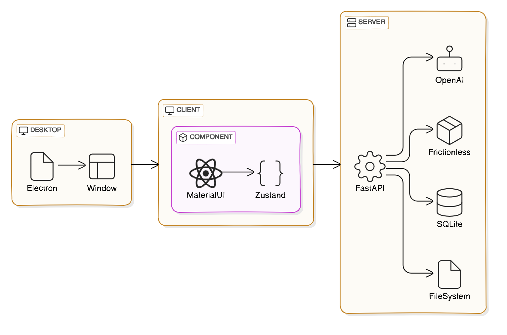
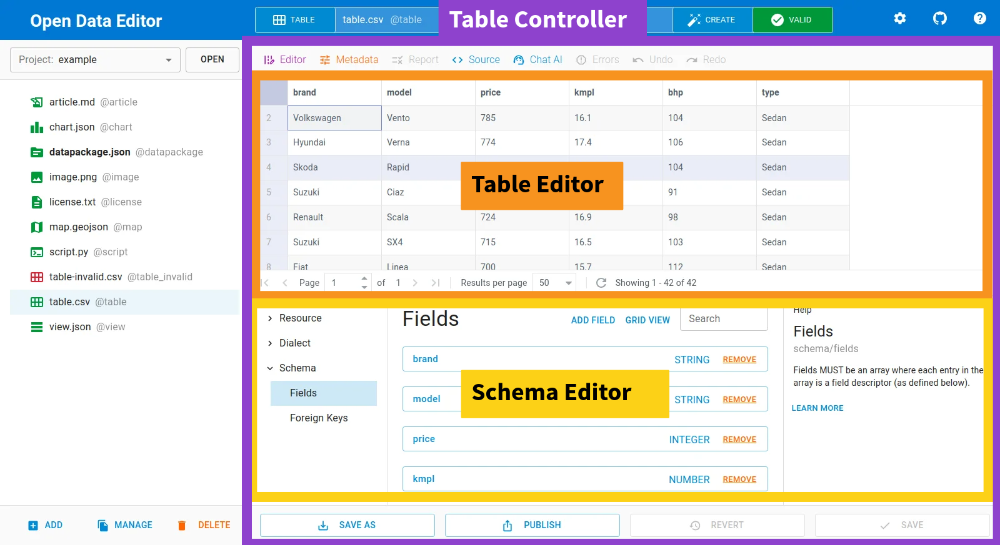

This document describes the architecture of the Open Data Editor project.

## Components

High-level design of the Open Data Editor project is shown in the diagram below. The project consists of the following components:

- **Desktop**: The desktop app component is responsible for providing a desktop application for the Open Data Editor project.
- **Client**: The client component is responsible for rendering the user interface and sending requests to the server.
- **Server**: The server component is responsible for handling requests from the client and interacting with the file system, database, and local or remote services.



### Desktop

The desktop component is built using the Electron framework. It provides a desktop application for the Open Data Editor project. The desktop component is responsible for starting the client and server components and managing their lifecycle, as well as environment management i.e. installing Python dependencies. This component is the tiniest part of the project and it is not required to be used for local development as the client and server components can be run independently.

The main technologies used in the client component are:

- TypeScript
- Electron
- Electron Builder

#### Components

The desktop component consists of the classical Electron architecture with the main process, renderer process, and context bridge:

##### Main Process

The main process is responsible for starting the client and server components and managing their lifecycle. It is also responsible for environment management i.e. installing Python dependencies. As in any Electron app, the main process is the entry point of the application and is responsible for creating the application window.

##### Renderer Process

The renderer process is responsible for rendering the client's `Application` component that communicates with the server using REST APIs.

##### Context Bridge

The context bridge is a feature of Electron that allows the renderer process to securely communicate with the main process. It is used to send messages between the renderer process and the main process. The only functionality that the client uses from the Electron native interfaces:

- getting a server port
- opening a project directory
- communicating fatal errors

#### Testing

Currently, the desktop component is not tested. The main reason for this is that the desktop component is a thin layer that starts the client and server components and does not contain any business logic. The client and server components are tested independently.

On the other hand, once [Bootstrap e2e testing](https://github.com/okfn/opendataeditor/issues/131) is setup it will be great to add at least some basic e2e coverage. The best case scinario would be having some unit testings as well for the main process and context bridge. In-general, the testing will require seting up a testing environment for the Electron app on different platforms.

### Client

The client component is responsible for rendering the user interface and sending requests to the server. It is built using React and communicates with the server using REST APIs.

The main technologies used in the client component are:

- TypeScript
- React
- MaterialUI
- Zustand
- Inovua
- Monaco
- Leaflet
- Vega

#### Components

The client uses a component-based architecture. Each component is responsible for rendering a specific part of the user interface. The components are nested and have different level of abstraction. Most of high-level components uses `Zustand` for shared state management while low-level components are stateless or use local `React.useState`.

Components that are required to have access to the server use the `Client` class singletone to access the server. The `Client` class is a wrapper around the `fetch` function that is used to send requests to the API. The `Client` class is responsible for providing client-side types information and error handling. Components get the `client` singleton instance as a prop as a part of dependency injection pattern.

##### Application

> Application USE `Zustand` for shared state management

The `components/Application` component is the root component of the application. It is responsible for rendering the main layout of the application and managing the file browser, the routing and controllers. The underlaying component are described in the sections belows and here is an examplar structure of the `Application` component for a tabular data source:



##### Controllers

> Controllers usually USE `Zustand` for shared state management

In the `components/controllers` folder there are components that are responsible for rendering a full data source representation including all the underlaying editors, views, and parts. Controllers are split by the file type e.g.:

- table
- text
- chart
- etc

##### Editors

> Editors usually USE `Zustand` for shared state management

In the `components/Editors` folder there are components that are responsible for editing different data and metadata sources. It includes editors for tables, texts, Data Package metadata entities, and more.

##### Views

> Views usually DON'T USE `Zustand` for shared state management

In the `components/Views` folder there are components that are responsible for rendering different data and metadata sources without an ability to edit the source. The most promenent example of a view is a `Report` that takes a [Frictionless Validation Report](https://framework.frictionlessdata.io/docs/framework/report.html) as one of the props and renders it to a visual representation.

##### Parts

> Parts usually DON'T USE `Zustand` for shared state management

In the `components/Parts` folder there are components that are used in multiple places in the application. They are usually low-level components such as dialogs or buttons that are used to build more complex components. Parts are basically a application-specific library of components that mostly based on `MUI` primitives.

#### Testing

A testing system hasn't been set up yet. Here is a list of issue for hadnling it:

- [Bootstrap unit testing for client](https://github.com/okfn/opendataeditor/issues/130)
- [Bootstrap e2e testing](https://github.com/okfn/opendataeditor/issues/131)
- [Recover Storybooks](https://github.com/okfn/opendataeditor/issues/360)

### Server

The server component is responsible for handling requests from the client and interacting with the file system, database, and local or remote services. It is built using FastAPI and communicates with the client using REST APIs.

The main technologies used in the server component are:

- Python
- FastAPI
- Pydantic
- SQLAlchemy
- SQLite
- TinyDB
- Frictionless
- OpenAPI

#### Components

The server component is built using the FastAPI framework. Currently, it uses synchronous Python functions. It consists of the following components:

##### Endpoints

The server component consists of a set of endpoints that are responsible for handling requests from the client. Each endpoint is responsible for a specific part of the application, such as managing projects, data sources, and metadata entities.

:::note
API doesn't use full REST API approach for simplicity. The main reason for this is that the API is designed to be used by the Open Data Editor client and not by external clients.
:::

All calls need to be `POST`. All the endpoints use `Pydantic` based `Props` and `Result` models. The endpoints routing is `subj/verb` based, for example, there are following endpoints:

- `POST /file/list`
- `POST /table/read`
- etc

The error handling is done by catching all the possible exceptions and returning a JSON response with the error message and status code.

##### Models

As per FastAPI architecture, the server component consists of a set of models. The models are written using Pydantic, which is a data validation library for Python. Pydantic is used to define the structure of the data that is sent and received by the API. The models are used to validate the data that is sent to the API and to serialize the data that is sent back to the client.

For example, there are models for:

- file
- table
- etc

##### Stores

The server component consists of a set of stores that are responsible for interacting with the file system and a database. The core stores are:

- **Config**: incapsulates application configuration management
- **Database**: incapsulates database management i.e. storing tabular data in a SQLite database
- **Filesystem**: incapsulates file system management i.e. reading and writing files
- **Metadata**: incapsulates metadata management i.e. storing metadata in a TinyDB database

#### Services

The server component consists of a set of services that are responsible for interacting with local or remote services. The core services are:

##### Frictionless

The Frictionless service is a [frictionless-py](https://framework.frictionlessdata.io/) library. The server uses the library direclty via its Python interface. The core Frictionless usage is:

- describing data sources i.e. inferring its metadata
- validating data sources i.e. checking its quality
- indexing tabular data sources i.e. streaming them into a SQLite database

There are also secondary tasks that Frictionless is used for like reading and writing JSON etc. Those applications might be removed over time to simplify the codebase.

##### OpenAPI

The OpenAPI service uses the official [OpenAI](https://pypi.org/project/openai/) driver to interact with the OpenAI API. The service is used to generate text based on the user input, and, in-general, is meant to provide a text-based AI assistant.

#### Artifacts

The appliction creates a set of artifacts that are stored in the user and project directories:

- `$HOME/.opendataeditor` - this directory contains system files i.e. Python virtual environment, examplar projects, logs, and user configuration
- `$PROJECT/.opendataeditor` - this directory contains project specific configration and artifacts. In also includes `.gitignore` file to exclude subset of artifacts from the version control system

The core artifacts are:

##### `config.json`

> The project-level `config.json` file is not meant to be checked into the version control system. It's included into `.gitignore` by default.

The configration exists both in the user and project directories. The user configuration is used to store the user settings and the project configuration is used to store the project settings.

Structure reference:

- a descriptor MUST be an object compatible with the [config model](https://github.com/okfn/opendataeditor/blob/main/server/models/config.py)

##### `metadata.json`

> The `metadata.json` file is meant to be checked into the version control system for projects that requires multiple user collaboration. It's excluded from `.gitignore` by default.

The metadata is stored in the project directory. The metadata is used to store all the information about fieles in the projects.

Structure reference:

- a descriptor MUST be an object with keys being **record names** and values being **record objects** (a **RECORD** is a core concept in the application; a record describes an individual resource in the project)
- a record MUST be an object with the following properties:
  - `name` (string) - the resource name
  - `type` (string) - the resource type (table/text/chart/etc)
  - `path` (string) - the resource path (within the project directory)
  - `resource` (object) - the resource descriptor as per [Data Resource](https://datapackage.org/specifications/data-resource/) specification. Initially, the descriptor is inferred from the file content by `frictionless-py`, later can be updated manually by user in the UI.

Example:

```json
{
  ...
  "players": {
    "name": "players",
    "type": "table",
    "path": "players.csv",
    "resource": {
      "name": "table-1",
      "type": "table",
      "path": "players.csv",
      "scheme": "file",
      "format": "csv",
      "mediatype": "text/csv",
      "encoding": "utf-8",
      "schema": {
        "fields": [
          {
            "name": "Name",
            "type": "string"
          },
          {
            "name": "Golden Balls",
            "type": "integer"
          }
        ]
      }
    }
  }
  ...
}
```

##### `database.db`

> The `database.db` file is not meant to be checked into the version control system. It's included into `.gitignore` by default. Note that table and column names are escaped by `sqlalchemy` but they are not changed from the user perspective e.g. comapred to a CSV file header.

The database is stored in the project directory. The database is used to store indexed tabular data sources in a SQLite database.

Structure reference:

- `_artifacts` (table) - the table is used to store information about the indexed tabular data sources that is not a part of the Data Package standard (i.e. validation reports). The table has the following columns:
  - `name` (string) - the record name
  - `type` (string) - the artifact type (report/measure)
  - `descriptor` (object) - the Frictionless [report](https://framework.frictionlessdata.io/docs/guides/validating-data.html#validation-report) OR the [measure](https://github.com/okfn/opendataeditor/blob/main/server/models/measure.py) object based on `type`
- `<record-name>` (table) - for every indexed tabular data source there is a table with the same name as the record name. The table has the following columns:
  - `_rowNumber` (integer) - the row number
  - `_rowValid` (boolean) - whether the row is valid
  - `<field-name>` (any) (one or more fields) - the rest of the table columns are the fields from the tabular data source.

#### Testing

## Workflows

## Design System

## Weaknesses Analysis
