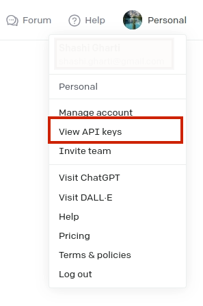

:::note
Adding an AI provider is totally **OPTIONAL** as Open Data Editor doesn't require it, but, we recommend doing so as it unlocks many features. Please take into account that AI provider will charge you for its usage, although, it's not expensive at all, and, usually, around 1-2$ per month. We recommend setting up a hard monthly limit to control the expenses.
:::

Open Data Editor supports integration with generative AI providers. Currently, the list of available providers is limited to **OpenAI**, but once there are good alternatives, especially free and open, we will suport them as well.

## Getting API Key

To get OpenAI `API Key` go to [OpenAI](https://platform.openai.com/) website and create an account by clicking on the `Sign Up` button. Navigate to the `View API keys` section.

Generate the API Key, clicking `Create new secret key` button.

## Connecting API Key

After getting the `API Key`, return to Open Data Editor, open the `Settings` page by clicking `gear` icon located in the top right of the editor.

Navigate to `Settings` page and set your api key.

## Using Generative AI

You can now use the AI features in various editing modes such as: `table`, `image`, `chart` and more. For instance, if you want to create a dataset using `CHAT AI`, click the `Create` button and navigate to `Dataset`. From there, use the `prompt` to give necessary instructions to the model to generate required data.

In the following sections, we will show a lot of examples of how to use AI features in Open Data Editor.
