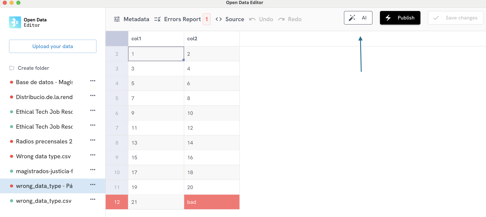
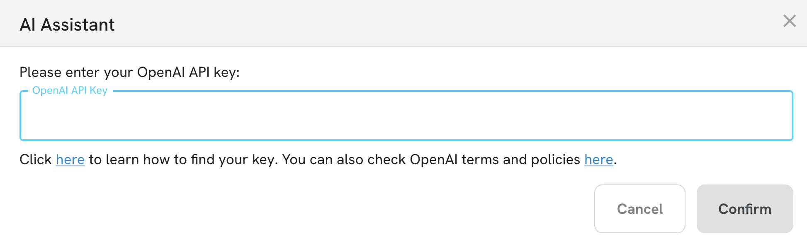

The ODE has an AI component to help users improve column names and descriptions from their tables. To use the AI feature, please first ingest or select a file from the sidebar. Then click on the AI button located on the top right corner of the app:

The tool will then display a dialog to inform the user that by confirming the action, the app will only share column names with OpenAI. If the user accepts, the next step is to add the OpenAI key. The dialog also includes a link to check OpenAI terms and conditions:

After pasting your OpenAI key, the ODE will show you a predefined prompt:

Finally, clicking on confirm will generate the response.

Note: The OpenAI integration is a pilot. The ODE team will collect feedback and improve the implementation in 2025. 
