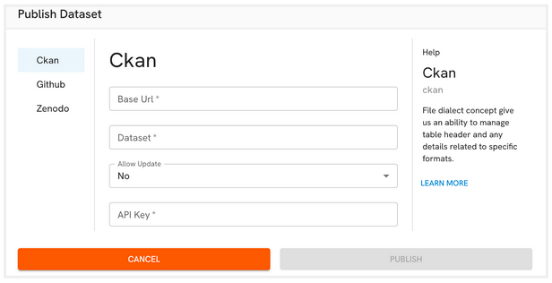

You can publish a file using the **Publish** feature located at the top right of the datagrid:

Once you click the **Publish** button, the ODE will display the following dialog:

:::note
To be able to publish, you have to set the required credentials to connect to a data portal (CKAN, Zenodo, Github).
:::