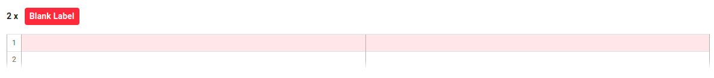
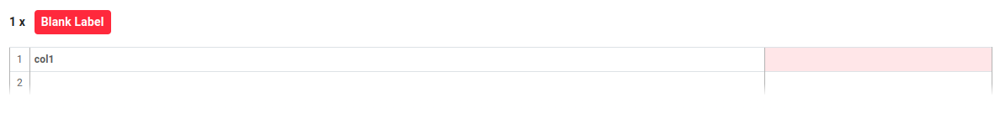
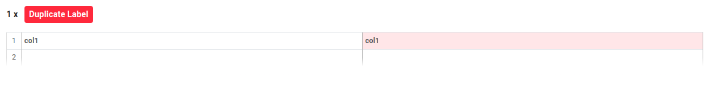
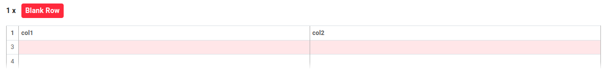
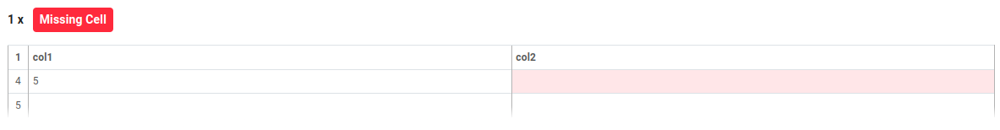
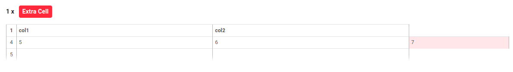
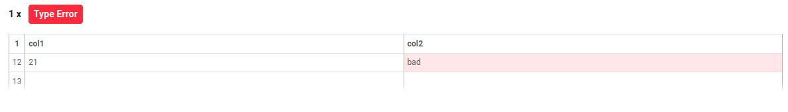

This article describes the tabular errors that can occur when working with tabular data in Open Data Editor. All the examples are based on CSV files. It is possible to reproduce a subset of these errors using other formats like Excel, but some errors might not be applicable to other formats. For example, it is not possible to have an `extra-cell` in Excel as it always has a rectangular structure.

Here is a demonstrational structure of a tabular data with the terminology used in this article. The table contains rows, one header row, and 1-n data rows. Each row contains cells. The header row contains cells called labels, and the data rows contain cells called values. The table is represented as follows:

```text
[1] [header row] label 1  | label 2
[2] [data row]   value 1  | value 2
[3] [data row]   value 1  | value 2
```

## Detected Automatically

This type of error occurs when the structure of the data is not as expected. For example, the number of columns in a row is different from the number of columns in the header. These errors can be identified **without providing a Table Schema**.

### Blank Header

This error occurs when the header row is empty. The header row should contain the names of the columns.

```csv
,
1,2
3,4
```



:::note
If the header row in CSV is completely empty (see the comma) this error won't be reproduced as `frictionless-py` detects that the data starts from the second row.
:::

### Blank Label

This error occurs when there is an empty cell in the header row. The header row should not contain any empty cells.

```csv
col1,
1,2
3,4
```



### Duplicate Label

This error occurs when there are two or more columns with the same name. Each column should have a unique name.

```csv
col1,col1
1,2
3,4
```



### Blank Row

This error occurs when there is an empty row in the data. The data should not contain any empty rows.

```csv
col1,col2
1,2

3,4
```



### Missing Cell

This error occurs when a row has fewer cells than the header. Each row should have the same number of cells as the header.

```csv
col1,col2
1,2
3,4
5
```



### Extra Cell

This error occurs when a row has more cells than the header. Each row should have the same number of cells as the header.

```csv
col1,col2
1,2
3,4
5,6,7
```



### Type Error

This error occurs when a cell contains a value that is not of the expected type. For example, a cell in a column that should contain numbers contains a string.

```csv
col1,col2
1,2
3,4
5,6
7,8
9,10
11,12
13,14
15,16
17,18
19,20
21,bad
```



:::note
This error can be identified without providing a Table Schema but only if the data has enough cells of the correct type in the column to infer the intended type.
:::

## Requiring Metadata

These errors can only be identified if a Table Dialect or Table Schema is provided by editing the table's metadata. The Table Schema defines the structure of the data, including the type of each column. Table Schema adds **additional** constraints to the data, which are used to validate the data.

### Extra Label
