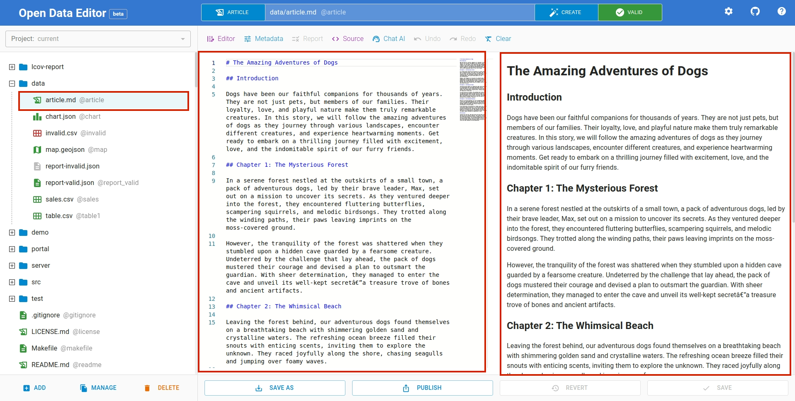
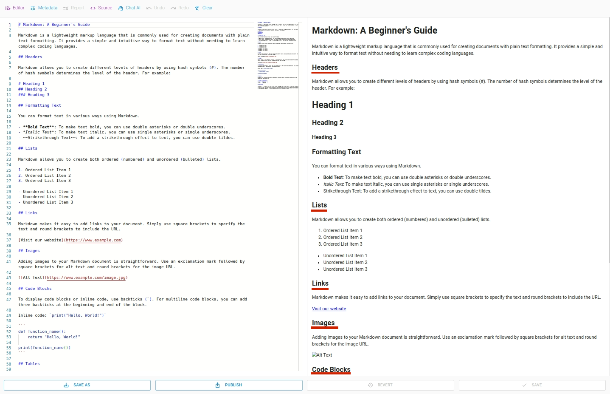
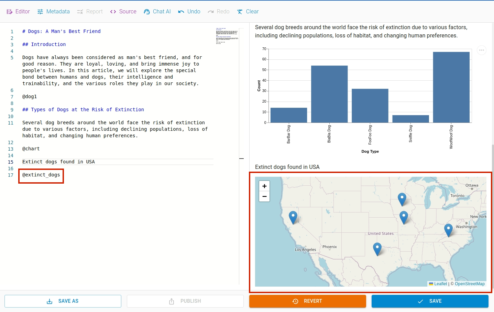
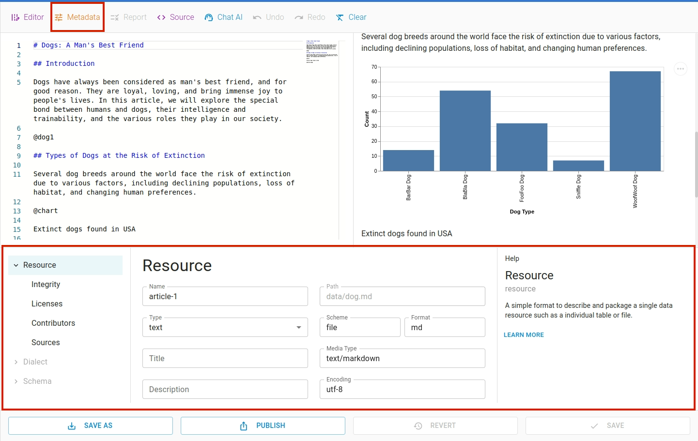
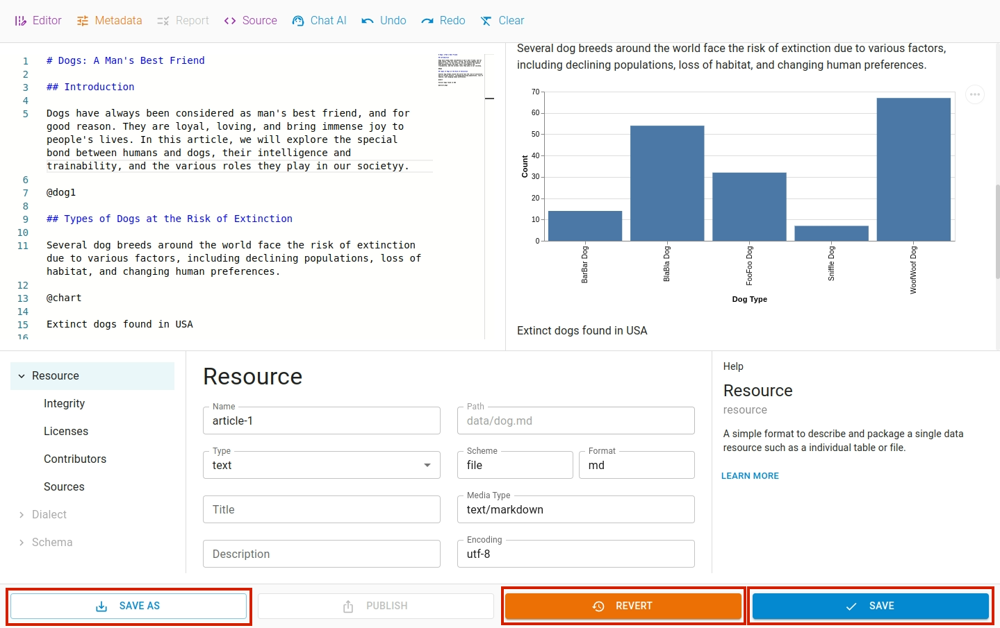
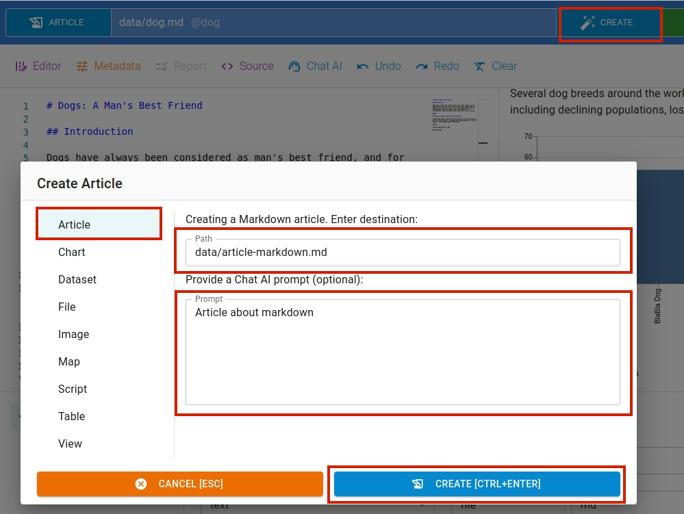
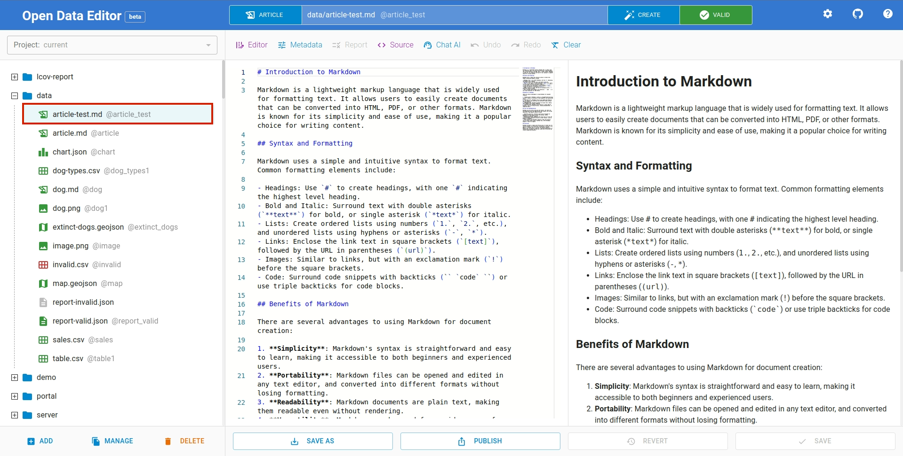

This section explains about how to work with articles in the editor using markdown language. The editor offers both editing and previewing features, which enables you to simultaneously edit and view the article.

## Creating an Article

If you already have article file, just `Click` on the article file in `File Explorer` on the left side of the editor to open the file in the editable form. You can format the article using markdown supported formatting rules.

If you haven't already added the article to the editor, click `ADD` button at the bottom left of the editor as shown below. It will open a file dialog to select the file to upload.

## Editing Article

Once you have the file, you can start adding the contents using markdown formatting features. It supports all the formatting elements of the markdown language such as headers, lists, emphasis etc.

To learn more about markdown formatting, refer to this [link](https://www.markdownguide.org/basic-syntax/).

## Including Image

To include image `image.png` in the article, use `@image` tag.

To include another image `dog.png` simply use `@dog1` tag. The files can be referenced using their unique name displayed in grey color as `@{name}`.

## Including Chart

Likewise, if you have a chart and want to include it in the article, you can do so by using `@{name}` tag. Similar to other files, chart is given a unique name, so we can reference them using their name.

## Including Map

Using same tag, you can also include map in the article. To include a map `extinct-dogs.geojson` we use tag
`@extinct_dogs`.

File name may differ from unique name(identifier), which is displayed in grey color as `@{uniquename}` in the `File Explorer`.

## Editing Metadata

To edit metadata of the article such as licenses, contributors, sources etc use metadata editor. Click `Metadata` menu on the toolbar to open the editor. To hide the editor, click on the menu again.

## Undo or Redo

You can undo or redo your last change using `undo` or `redo` feature in the `tools` menu.

## Saving or Reverting

Once you modify the article, you can save the changes using `Save` button. When changes are made, the `Save` and `Revert` button gets activated at the bottom of the editor. If needed, you can revert the changes by clicking the `Revert` button.

The changes can be saved in a different file using `Save As` button.

## Creating / Editing an Article with AI

To generate data using AI, click `Create` button. A `Create File` dialog box will appear. Navigate to the `Article` tab.

In `Article` tab, input `filename` and write a data generation command in the `prompt` input box. We use OpenAI's `ChatGPT` large language model API.

Similarly, you can edit a table content by issuing command to AI. To access this window, select `Chat AI` option from the toolbar menu.

Enter your instruction to AI in the promt input box and apply the command by clicking the `EDIT` button. The resulting output is as follows:

