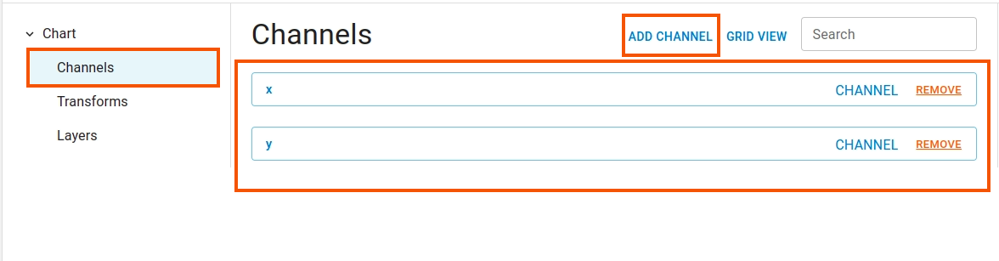
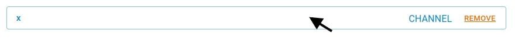
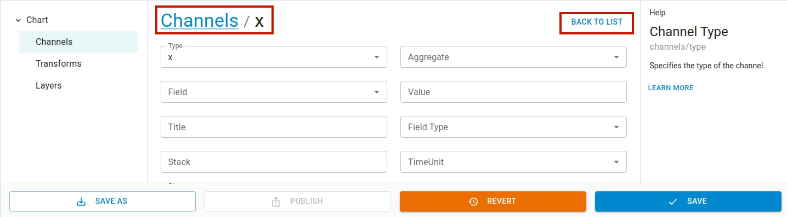
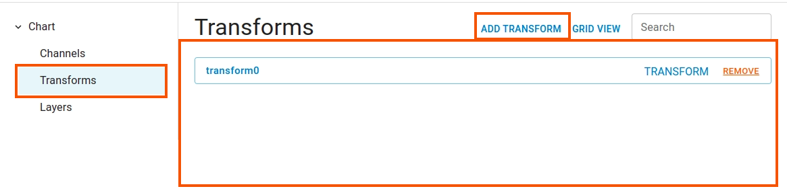
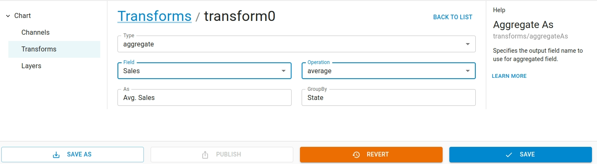
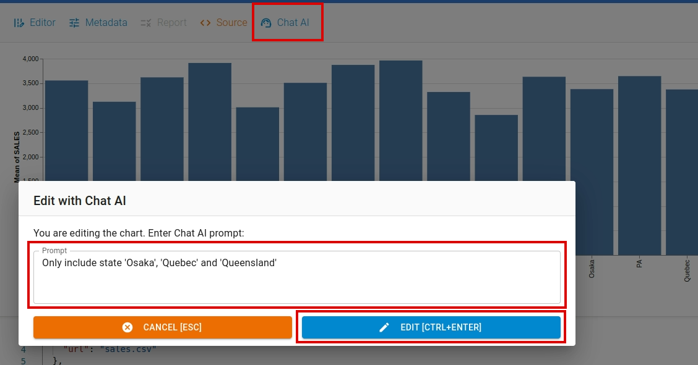
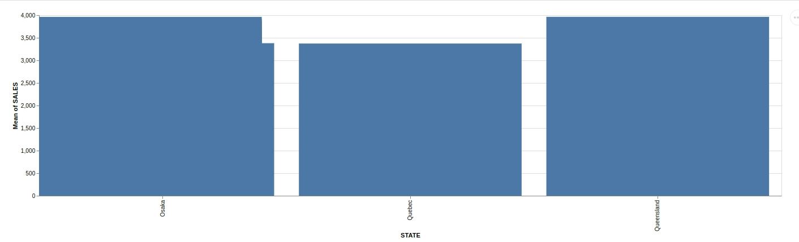
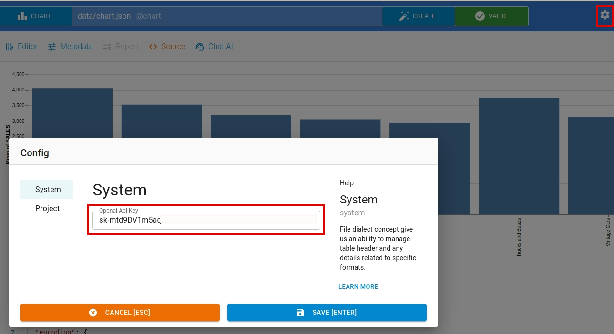

This section explains about how to use the chart feature in the Open Data Editor. The `Chart Editor` makes it easy to create charts without any code. The editor generates vegalite specification from the user input, which is passed to vegalite library to generate charts.

## Creating a chart

To create a chart, simply click on the `create` button and a dialog box opens. Navigate to `Chart` tab, you can either modify the name of the file or keep the default name `chart.json`.

After setting file name, click `Create` button, a chart file will be generated with the name you selected `<filename.json>`.

Initially, chart specification is empty so you will not see any chart. You can make changes to the chart file by using Chart Editor.

Once you update the chart specifications, the chart will be rendered in the `Chart Viewer` window.

## Editing chart

You can edit the chart specifications to customize it exactly how you want it to be rendered using `Chart Editor`. To hide the editor simply click the `Editor` icon.

The editor allows us to make changes easily using GUI without requiring any understanding of the low level details of vegalite specification. It has three sections: a menu explorer, an input form and a help window.

It supports adding channels, transforms and layers feature.

## Encoding or Channel

The channels allows us to add multiple `Encodings` to map data fields to visual properties of a chart. To go to encoding/channel list, navigate to `Chart > Channels`. The term `Channel` and `Encoding` will be use alternatively here.

For example, to generate a bar chart with sales on `X` axis and states on `Y` axis as follows:

The table fields `Sales` and `State` needs to be mapped with `X` and `Y` channels.

Here is how the encodings look like:

To add a new encoding/channel, click `Add Channel`. Likewise, to remove an encoding just click `Remove` button on the encoding.

To make changes to the encoding, `double click` on the encoding button.

Inside the encoding input form, you can set values as per your requirement. To get back to the encoding/channel list, click `BACK TO LIST` button.

You can find the detailed explanation of vegalite encoding [here](https://vega.github.io/vega-lite/docs/encoding.html).

## Transforms

You can apply transformations such as sum, agregation calculate etc to the data using transform feature. To add a new transform, navigate to `Chart > Transforms` and click `Add Transform` menu in the `Transforms` list page.

To make changes to the specific transform, `double click` on the transform button.

Once the transform input form is open, you can make the required changes. Click `BACK TO LIST` to go back to the transform list view page.

To remove any transform click `Remove` button

To learn more about vegalite transform you can find the detailed document [here](https://vega.github.io/vega-lite/docs/transform.html).

## Layers

Using layers feature, you can create complex visualization by overlaying multiple charts layers on top of each other. To add a new layer, navigate to `Chart > Layers` and click `Add Layer` menu in the `Layers` list view page.

To remove any layer click `Remove` button

After adding layer, you can add `Encoding/Channel` and `Transform` by clicking the newly created layer menu.

To add encodings and transforms navigate to the respective submenus and click `Add channel/transform` button.

To change the content of a channel or transform, `dblclick` on the corresponding button. Similarly to delete a channel or transform simply click `Remove` button.

To learn more about vegalite layers you can find the detailed document [here](https://vega.github.io/vega-lite/docs/layer.html).

## Source view

To view the chart file in its raw form, click on `source` menu. To hide, click on the menu again.

## Saving / Reverting

You can modify the chart content by using `Chart Editor`, `Source View` or using `Chat AI`. When changes are made, the `Save` and `Revert` button gets activated at the bottom of the editor. You can save your changes by clicking `Save` button.

If needed, you can revert the changes clicking the `Revert` button. You can save it as a new file as well.

## Publishing

To open the publishing window, click the `Publish` button located at the bottom of the chart editor page. After you've chart ready, click the `Publish` button to initiate the publishing process

Similarly, you can also publish it to `Zenodo` or `Github`

## Creating / Editing Chart with AI

To generate chart using AI, click `Create` button. A `Create File` dialog box will appear. Navigate to the `Chart` tab.

In `Chart` tab, input `filename` and write a data generation command in the `prompt` input box. We use OpenAI's `ChatGPT` large language model API.

Similarly, you can edit a chart content by issuing command to AI. To access this window, select `Chat AI` option from the toolbar menu.

Enter your instruction to AI in the prompt input box and apply the command by clicking the `EDIT` button. The resulting output is as follows:

To use `CHAT AI` feature, you have to set the `OpenAI API Key`. To set the api key, click `Settings` menu.

