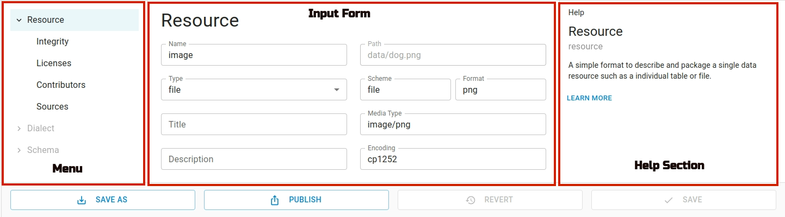

Open Data Editor allows to work with other files such as JSON. Currently, the editor can't open binary files like PDF but you still can add and edit their metadata.

## Opening a File

Choose the file in the file browser and click on it:

## Editing Metadata

You can add the metadata to the ile by clicking `Metadata` menu in the toolbar. To hide metadata editor, just click the menu again.

The metadata editor has three sections: Menu, Input form and Help. Using menu explorer you can navigate to different input pages and make changes to the metadata.

## Publishing

You can publish a file using `Publish` feature. To be able to publish, you have to set the required credentials to connect to data portal (CKAN, Zenodo, Github).

