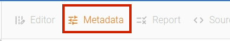
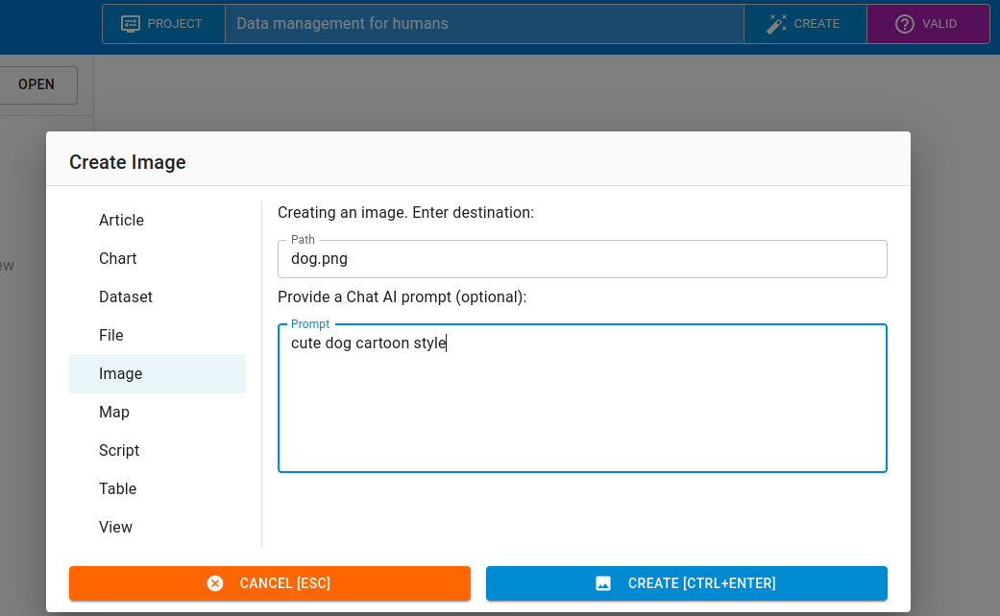
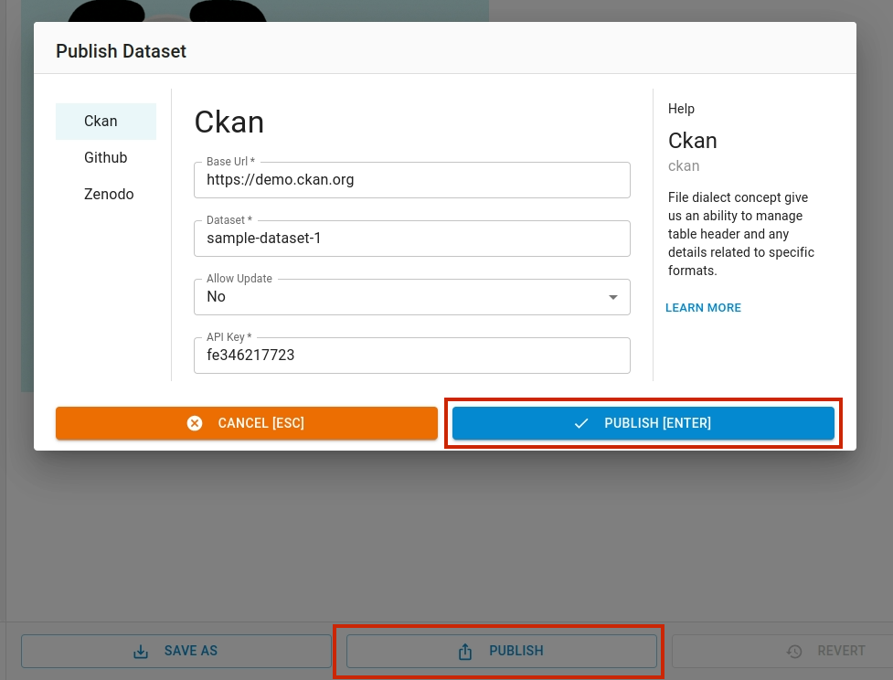

This section explains how to work with images in Open Data Editor.

## Opening Image

To open the image file, simply click on the image file in the `File Explorer` on the left pane.

If you haven't already added the image file to the editor, click `ADD` button at the bottom left of the editor as shown below. It will open a file dialog to select the file to upload.

## Adding Metadata

You can add the metadata to the image file by clicking `Metadatata` menu in the toolbar. To hide metadata editor, just click the menu again.

The metadata editor has three sections: Menu, Input form and Help. Using menu explorer you can navigate to different input pages and make changes to the metadata.

## Revert / Save

When modifications are made to the file, the `Revert` and `Save` buttons gets activated. You can save the changes using `Save` button. If you want to revert the changes, just click `Revert` button.

To save the changes as a new file, click `Save As` button and input a new name for the file.

## Using AI with Images

You can also generate an image using AI prompts by giving commands. To use AI feature, click `Create` button, and navigate to `Image` tab.

Enter a promt you like and click "Create" button:

## Publishing

You can publish a file using `Publish` feature. To be able to publish, you have to set the required credentials to connect to data portal (CKAN, Zenodo, Github).

