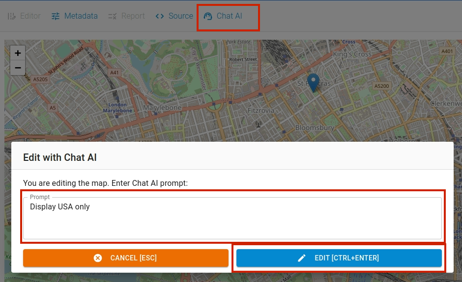
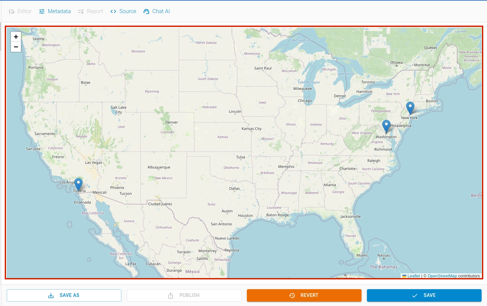

This section explains about how to work with geojson files. GeoJSON file stores geographic data which can be used to create custom maps.

## Opening Map

To open the map view, click on the map file for example `map.geojson` in the `File Explorer`.

If you haven't already added the map to the editor, click `ADD` button at the bottom left of the editor as shown below. It will open a file dialog to select the file to upload.

## Adding / Editing Metadata

This map file can be either part of a package or a standalone resource file. To add/edit metadata such as license, contributors etc, you can use `Metadata Editor`. To open the metadata editor, click `Metadata` menu on the toolbar.

The editor contains three sections: Menu Explorer, Input Form and Helper Section. `Metadata Editor` provides easy way to update the metadata of the file.

## Source View

To view the file in the raw form, click on `Source` menu in the toolbar. To hide, click on the menu again.

## Saving / Reverting

After creating or editing the `map` file using Chat AI, you can either revert or save the changes. When changes are made to the map file, the `Revert` and `Save` button gets highlighted.

To save your changes, click the `Save` button. If you want to undo the change, click the `Revert` button. Using `Save As` button you can save the map to a different file.

Now, the map is ready to be published.

## Using AI with Maps

To create map using AI, click `Create` button. A `Create File` dialog box will appear. Navigate to the `Chart` tab.

In `Chart` tab, input `filename` and write a chart generation command in the `prompt` input box. We use OpenAI's `ChatGPT` large language model API.

Similarly, you can edit a table content by issuing command to AI. To access this window, select `Chat AI` option from the toolbar menu.

Enter your instruction to AI in the promt input box and apply the command by clicking the `EDIT` button. The resulting output is as follows:

## Publishing

To open the publishing window, click the `Publish` button located at the bottom of the package editor page. After you've added the CKAN details, click the `Publish` button to initiate the publishing process.

Similarly, you can also publish it to `Zenodo` or `Github`.
