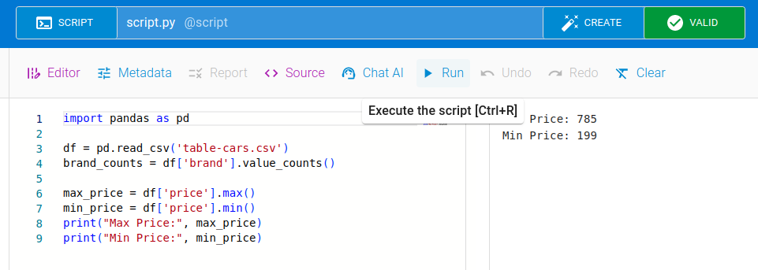
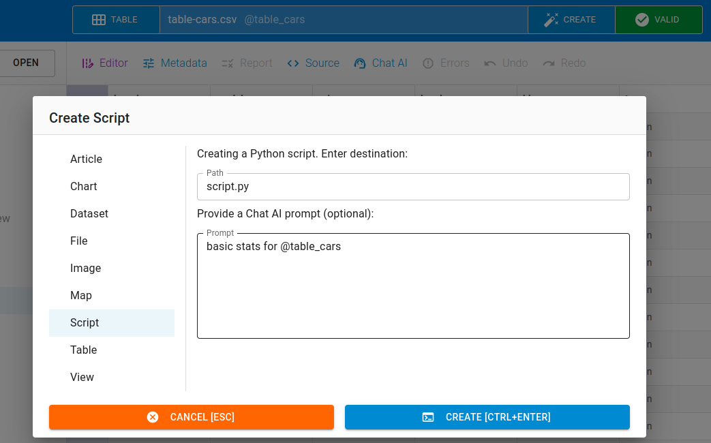
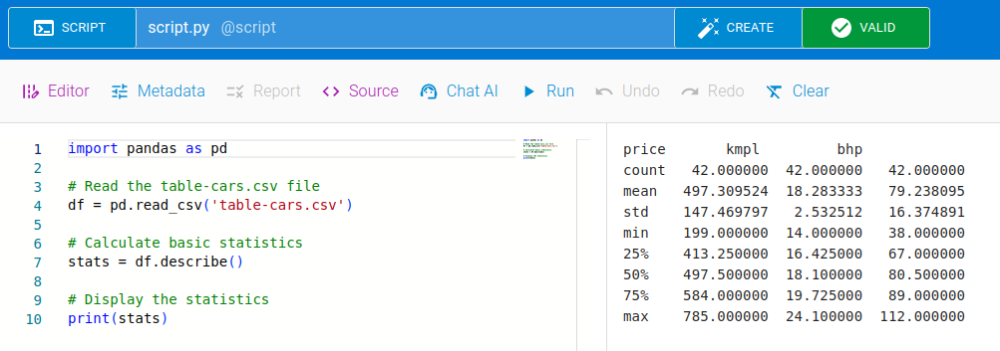

The editor also supports opening python script file with preview feature. If you have the python file uploaded to the editor, you can simply click the file in `File Explorer` in the left pane to open it.

## Opening Script

After you make the changes, you can save it with `Save` button. If you don't like the changes, then you can easily revert the changes using `Revert` button. Likewise, you can also save the changes to a new file using `Save As` button.

Editor also has other features to `Undo`, `Redo` and `Clear` the changes.

## Running Script

:::note
Currently, only fixed amount of dependencies are supported, for example, `pandas` and `frictionless`
:::

To run the script click the `Run` button in the menu panel above the editor:

## Using AI with Scripts

Click on the `Create` button, select `Script`, choose a scrip file name, and input a prompt:

Click on `Run` to run the generated script:

## Publishing

You can publish a file using `Publish` feature. To be able to publish, you have to set the required credentials to connect to data portal (CKAN, Zenodo, Github).

