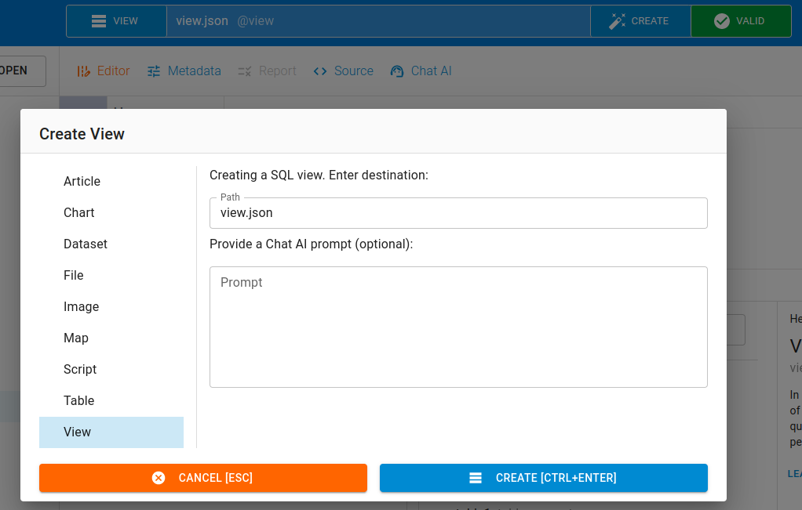
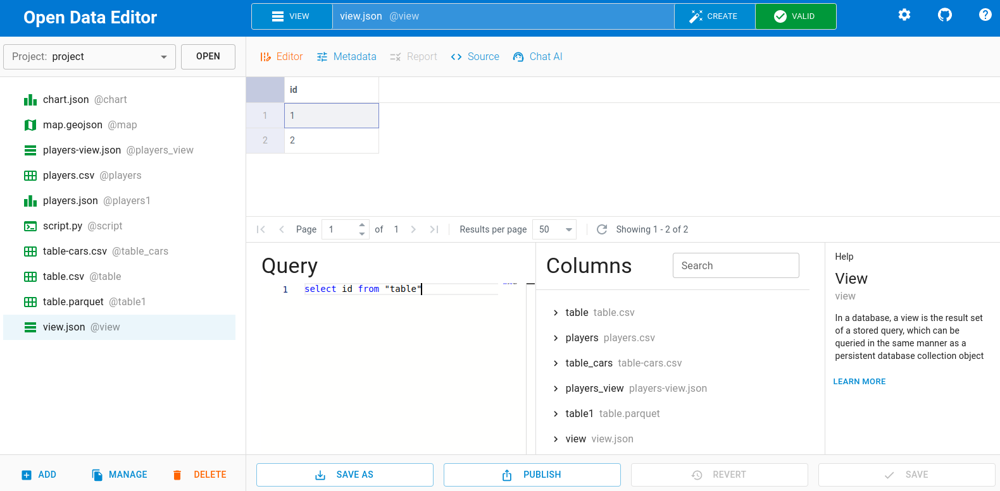
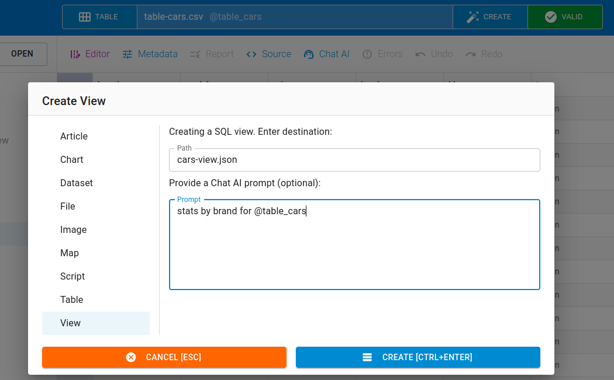
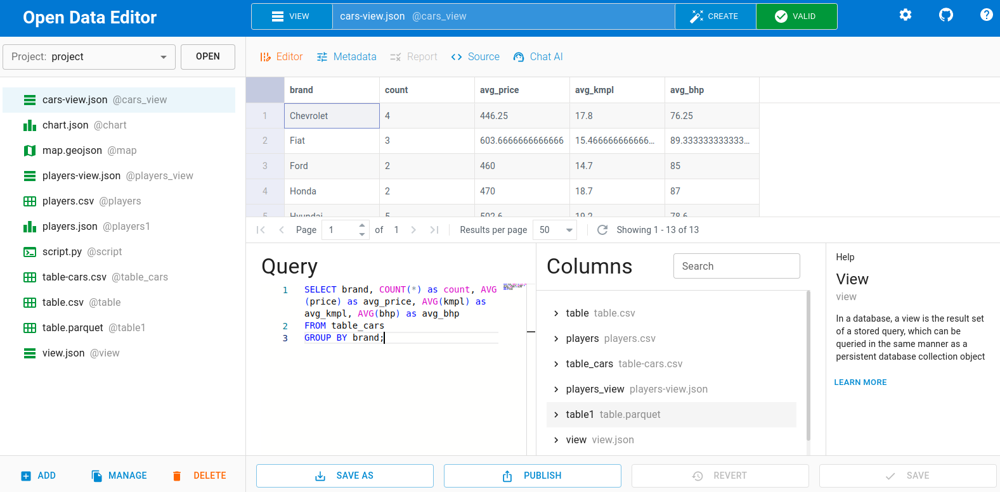
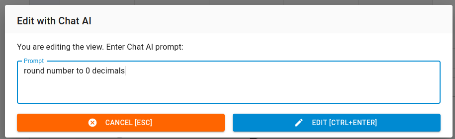
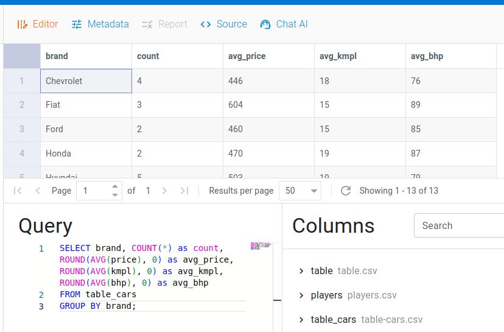

In this short section, we will show how to use SQL views in Open Data Editor.

In a database, a view is the result set of a stored query, which can be queried in the same manner as a persistent database collection object.

With Open Data Editor you can create as many views on top of you tables as needed, and use them to create charts and write data stories. Moreover, you can create a view from another view for more complex scenarios.

:::tip
Once, you data changes SQL views will update automatically, as well, as all the charts and articles that use them. Think about views as a "window" to your data
:::

## Creating a View

To creat a SQL view, click the `Create` button on the top of the screen and select a view file path, for example, `view.json`:

## Editing a View

Since a view is created, you can edit it by updating the SQL query in the form below the data table. Once it's updated, click on `Save` to see the updated data. The table viewer here is no different to the one that regular tables have so you can use any features described in the [Tables Guide](../working-with-tables) like pagination or sorting:

Note that you can double-click on a table or a column in the `Columns` section to insert its name to the Query editor.

## Using AI with Views

To create a SQL view using help from AI, click on the `Create` button, enter the view file path and provide a prompt:

The view will be created automatically so you don't even need to know SQL to start getting insight from data:

Once, it's created you can manually edit the query or use `Chat AI` button to update the query with AI help:

You need to click on save to udpate the data:

