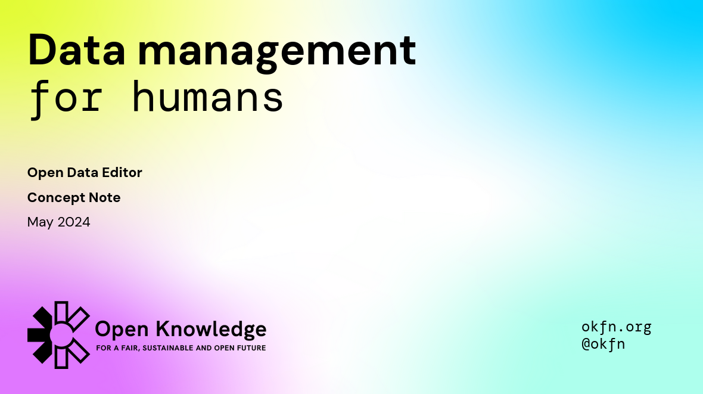

import { Card, CardGrid } from '@astrojs/starlight/components'
import About from '../../components/about.astro'

<strong>Open Data Editor (beta)</strong> for early adopters has been released on <strong>
  Oct 2, 2023
</strong> -- [DOWNLOAD THE CONCEPT NOTE](../../ode-concept-note.pdf)

---

<About title="Brought to you by">
We are building a world open by design where all knowledge is accessible to everyone

[Learn about Open Knowledge](https://okfn.org)

</About>
