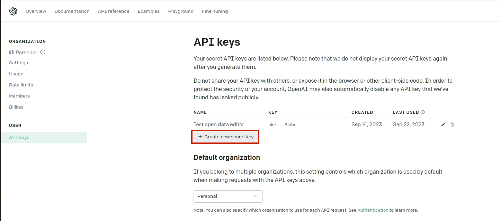
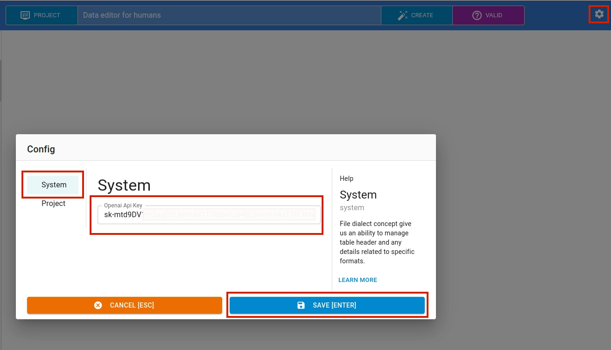
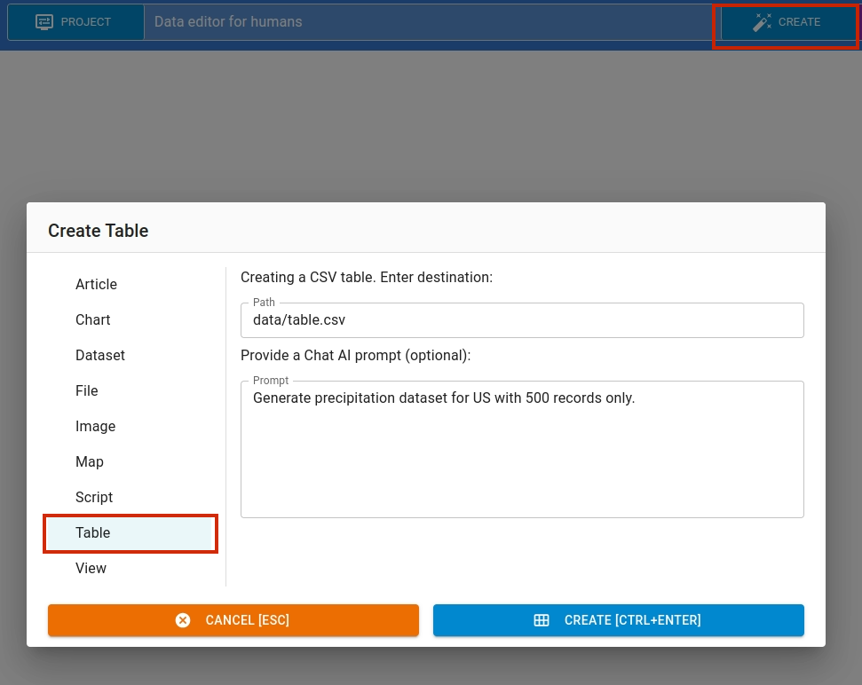

This section explains about how to use `CHAT AI` feature.

## API Key
To get OpenAI `API Key` go to [OpenAI](www.openai.com) website and create an account. Navigate to API Section.

Generate the API Key, clicking `Create new secret key` button.

## Open Data Editor

After getting the `API Key`, open the `Settings` page by clicking `gear` icon located in the top right of the editor.

Navigate to `Settings` page and set your api key.

## How to use CHAT AI

You can now use the `CHAT AI` feature in various editing modes such as: `table`, `image`, `chart` and more. For instance, if you want to create a dataset using `CHAT AI`, click the `Create` button and navigate to `Dataset`. From there, use the `prompt` to give necessary instructions to the  model to generate required data. 

