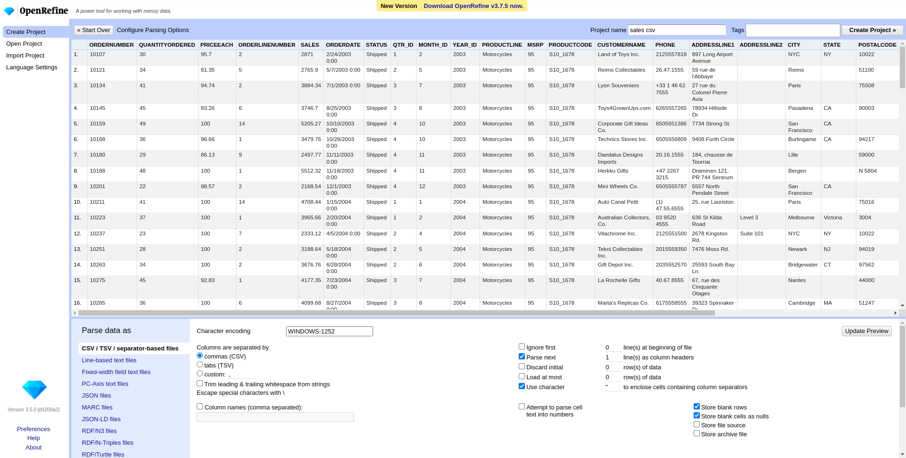
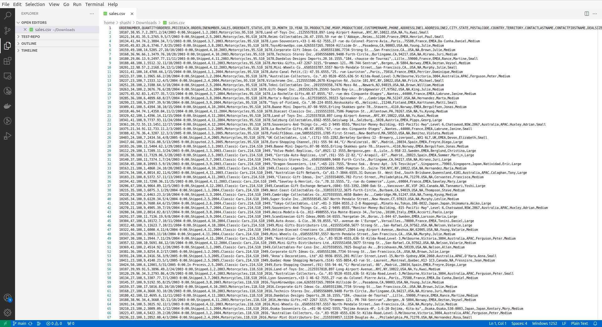

There are several alternatives available for open data editors with their own pros and cons. Some of them are:

## Openrefine
Openrefine is an open source web application tool that has various features to edit and clean the data. It allows users to process tabular data and has features to export the processed data. It offers an extensive set of features for both data exploration and cleaning such as filtering, faceting, clustering, edit data, join, merge, reconcile etc. More information about OpenRefine can be found [here](https://openrefine.org).

## Delimiter App
Delimiter App is a lightweight tabular data(CSV) editing tool which has grid-like structure and allows editing the data such as inserting, deleting, editing etc. After editing it can be synced with github directly. More information about Delimiter App can be found [here](https://delimiter.netlify.app).

## Datasette
Datasette is an open source web application tool that allows users to  explore and publish data. It provides various features to filter and query the data to understand the characteristics of the data. It also has a feature to publish the data. There are various plugins available for datasette such as datasette-leaflet, datasette-json-html etc. More information about Datasette can be found [here](https://datasette.io).

## Excel
Excel is also a multi-purpose tool which can be used to explore and clean data with various features such as filters, excel formulas, analyze features, charts, data editing features etc. With these features it empowers users to work with data more efficiently. More information about Excel can be found [here](https://www.microsoft.com/en-us/microsoft-365/excel).

## VScode
VScode is a code editor but can be used as a tool to edit csv files in its raw format. More information about VScode can be found [here](https://code.visualstudio.com).

